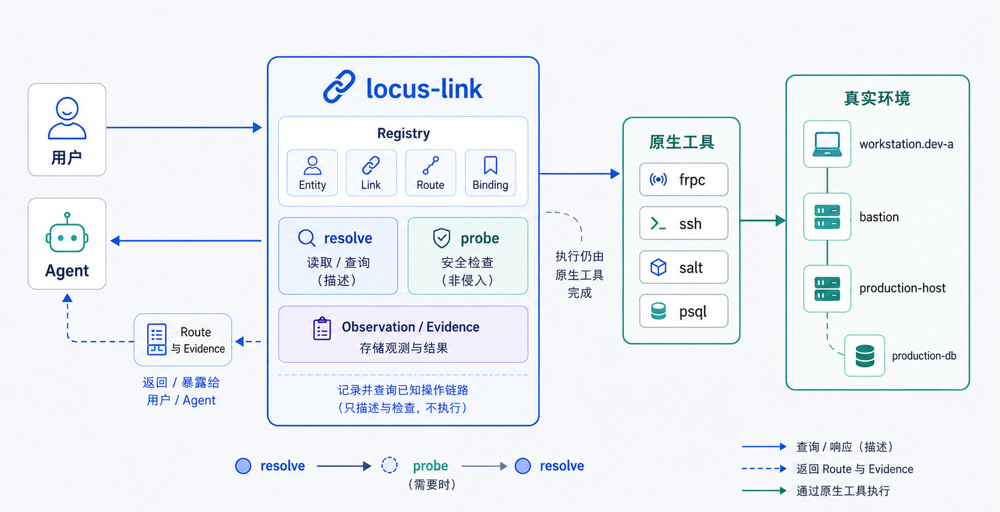
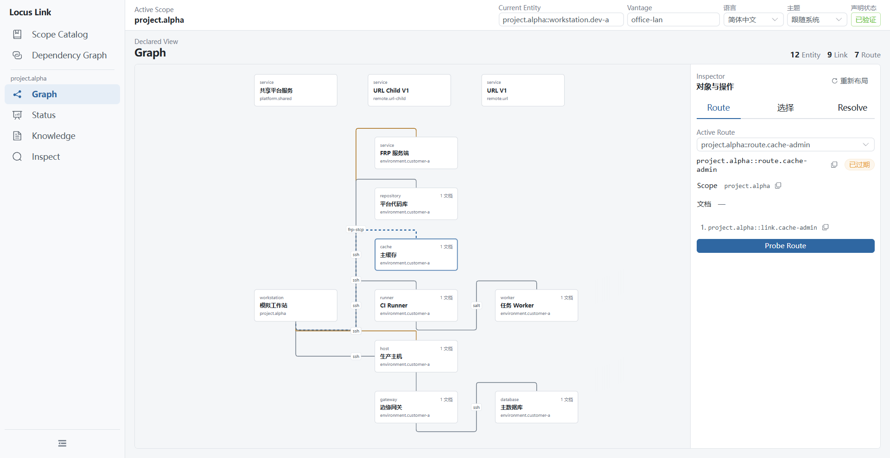

# locus-link

locus-link 用于记录和查询具体环境中已经确认的访问与操作链路。

Registry 描述需要访问的对象、对象之间已知的 Link，以及为特定目标能力声明的 Route。用户或 Agent 可以通过 `resolve` 查询匹配的显式 Route，并取得各步骤的底层机制、相关文档和已有探测结果。

locus-link 不执行 Route 本身。它不会建立 FRP tunnel、SSH session 或执行 Salt、数据库等操作；这些工作仍由对应的原生工具或其他执行系统完成。`probe` 只执行 Provider 定义的有限检查并记录结果。Secret 由外部 credential mechanism 管理，Registry 中只保存引用。



## Quick Start

在包含 `.locus/registry` 的项目或其子目录中：

```text
locus resolve production-host shell --from workstation.dev-a --vantage office-lan
```

`resolve` 查找符合目标、能力和当前现场的已声明 Route，并返回有序 Link、底层调用信息、文档引用和当前可用的探测证据。

需要更新证据时：

```text
locus probe route.prod-shell --from workstation.dev-a --vantage office-lan
locus resolve production-host shell --from workstation.dev-a --vantage office-lan
```

基本使用方式是：

```text
resolve → probe（需要时）→ resolve
```

`resolve` 是只读操作，不会隐式 Probe。`probe` 测量指定 Link 或 Route 中的 Link，并追加 Observation，不执行 Route 所描述的实际操作。

`--from` 表示本次操作从哪个 Entity 出发；`--vantage` 表示本次网络观测所在的位置。



## Model

| 概念            | 含义                                                              |
| --------------- | ----------------------------------------------------------------- |
| **Entity**      | 需要访问或操作的对象，例如工作站、服务器、数据库或代码仓库        |
| **Link**        | 两个 Entity 之间已经登记的操作关系，并声明所需和提供的 capability |
| **Route**       | 为某个目标能力选择并排序的一组已有 Link                           |
| **Binding**     | 当前 Scope 中的业务名称到具体 Entity 的映射                       |
| **Observation** | 一次 Probe 产生的测量记录                                         |
| **Scope**       | 一组具有稳定 identity 的声明及其显式 imports                      |

Route 是对已有 Link 的显式组合。当前 `resolve` 不进行自动寻路，也不会根据 Probe 结果自动修改 Route。

## Registry

项目 Registry 默认位于：

```text
.locus/registry/
```

如果当前目录向上找不到更近的项目 Registry，locus-link 使用用户目录 `~/.locus/registry`；`${LOCUS_HOME}/registry` 可覆盖该默认值。命中 `~/.locus` 时标记为用户根，命中更近的项目 `.locus` 时标记为项目根。

Registry 使用 `locus/v1` YAML 声明 Scope、Import、Binding、Entity、Link 和 Route。Scope 可以显式 import 本地目录、Git 或 ZIP URL Source。普通查询只读取本地声明和已激活的 remote cache；远程内容只由显式 `refresh` 获取。

创建一个项目 Registry：

```text
locus init --scope-id project.example --import-user user --register
locus validate
```

完整声明格式见[声明 YAML 公共契约](documents/design/contracts/声明契约.md)。

## Commands

| 命令                                         | 用途                                                |
| -------------------------------------------- | --------------------------------------------------- |
| `locus resolve <target> <capability>`         | 查询匹配的显式 Route 和当前证据                     |
| `locus probe <link-or-route-id>`             | 探测 Link 或 Route                                  |
| `locus status [link-or-route-id]`            | 查看当前 evidence                                   |
| `locus graph`                                | 查看当前收集到的 Scope 和声明图                     |
| `locus show <ref-or-id>`                     | 查看一个声明对象                                    |
| `locus list [binding\|entity\|link\|route]`  | 列出声明                                            |
| `locus context`                              | 查看当前 Registry、Scope、actor 和 vantage 等上下文 |
| `locus refresh [alias-path]`                 | 显式获取并检查 remote Registry 更新                 |
| `locus ui`                                   | 启动本机 Web UI                                     |

完整 flags、JSON 输出、退出码和副作用见 [CLI 公共契约](documents/design/contracts/CLI契约.md)。

## Build

开发环境需要 Go 1.26、pnpm 11 和 Node.js 24。

Windows PowerShell：

```powershell
./scripts/build.ps1
./scripts/verify.ps1
```

Linux：

```bash
./scripts/build.sh
./scripts/verify.sh
```

完整产物分别为 `temp/bin/locus.exe`（Windows）和 `temp/bin/locus`（Linux）；backend 产物分别为 `locus-backend.exe` 和 `locus-backend`。其他开发脚本见 [`scripts/README.md`](scripts/README.md)。

## Documentation

- [设计文档](documents/design/README.md)
- [CLI 公共契约](documents/design/contracts/CLI契约.md)
- [声明 YAML 公共契约](documents/design/contracts/声明契约.md)
- [Web 契约](documents/design/contracts/Web契约.md)
- [当前实现快照](documents/current-architecture.md)
