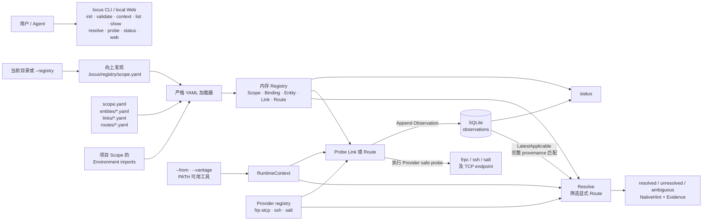
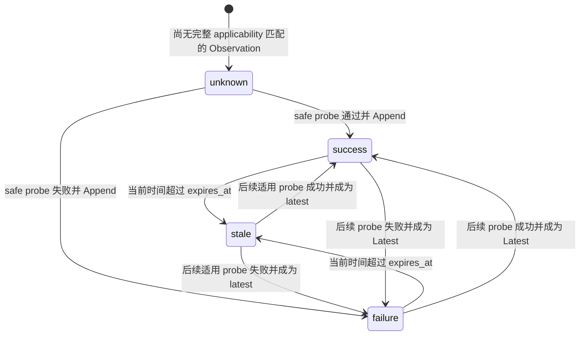

# locus-link 当前实现快照

本文只记录当前 Go 实现与可执行 E2E 已经证明的事实，作为易变实现清单。公共目标由 [`design/contracts/`](design/contracts/README.md) 定义，核心概念由[基础核心概念](design/base-核心概念.md)定义，Scope/Registry/Source 目标由[基础 Scope 设计](design/base-Scope设计.md)定义，用户根入口与本机状态目标由[用户级 Locus 设计](design/base-用户级Locus设计.md)定义，Core 内部目标由[基础系统设计](design/base-系统设计.md)和[基础数据设计](design/base-数据设计.md)定义。除“明确未实现”一节外，本文不描述计划中的架构。

## 1. 总体结构与数据流

当前发布一个 `locus` executable：Cobra CLI 与 loopback WebUI 共用 `internal/locus` Core。声明保存在 YAML Registry 中，运行观测追加到本机 SQLite；Resolve 读取声明和既有 Observation，但不会主动 Probe。



## 2. 声明与存储布局

### 2.1 Registry 与用户级 Locus

```text
.locus/registry/                    # 项目根
├── scope.yaml
├── entities/*.yaml
├── links/*.yaml
├── routes/*.yaml
└── docs/

${LOCUS_HOME}/
├── registry/                       # 用户根 Scope
└── cache/
    ├── candidates/                 # 临时获取目录
    └── objects/<content-digest>/   # 已校验 immutable Registry
```

- `scope.yaml` 与对象声明严格使用 `api_version: locus/v1`；`scope_id` 直接位于 manifest 顶层，不存在 `scope.kind`。
- 未显式传入 `--registry` 时，先从当前目录向上寻找项目 `.locus/registry/scope.yaml`；找不到时使用 `${LOCUS_HOME}/registry`。
- `LOCUS_STATE_PATH` SQLite 保存 Observation、项目反向登记、remote edge active cache 和 Scope authority。登记信息不会向用户根合并声明。
- 对象目录只读取一级 `.yaml`/`.yml` 普通文件；每个文件只允许一个 YAML document。未知字段、重复 key、多 document、错误 `api_version` 和同 Scope local ID 冲突均被拒绝。
- Scope content digest 覆盖排序后的 registry-relative path、长度与文件 bytes，包括 manifest、声明和 docs，排除 Git metadata 与 cache metadata。

### 2.2 Scope、Import、Binding 与身份

- 规范身份固定为 `<scope-id>::<local-id>`。Binding、Entity、Link、Route 在 owning Scope 内共用 local ID 名字空间。
- Import 是 alias map；scalar directory/Git/URL locator 或带 expected `scope_id` 的结构化 Source 均归一化到 `directory|git|url`。
- Collector 递归处理显式 import graph，按 `scope_id` 与 content digest 去重并保留全部 alias paths。回边只阻断当前 edge；缺 cache、Source 失败、identity 冲突和 authority 冲突产生稳定 `blocked_imports`，其余已验证节点组成 partial Declared View。
- 引用解析统一支持根 Scope local ID、任意长度 `alias::...::local-id` 和 canonical ID。Binding 是 owning Scope declaration；裸 role 只在根 Scope 解析。
- Link 的 `from/to` 与 Route step 在加载校验时规范化。Route 必须非空，并按 step 顺序验证 capability fold；当前不要求相邻 step 的 `to/from` 连通。
- documentation reference 必须解析后仍位于 owning Registry 的 `docs/`；Graph 和 Knowledge projection 使用稳定 document identity。

### 2.3 Remote Source 与显式 refresh

- 普通 `graph/list/show/context/resolve/status/probe` 只读取 directory Source 与已激活 immutable remote object，不执行 Git、HTTP 或其他隐式 fetch。
- `locus refresh [alias-path]` 是唯一 remote 获取入口。Git revision 解析为 commit；URL 仅接受受大小、entry 数、路径穿越和 symlink 限制的 ZIP Registry。
- Candidate 通过严格 Registry、expected/actual `scope_id`、declaration 和 docs containment 校验后，移动到 `<home>/cache/objects/<digest>`。
- edge cache 与 Scope authority 在单个 SQLite transaction 中激活。失败 candidate 不修改 active pointer；已有 cache 时结果报告 retained revision/digest，首次失败保持 blocked。

### 2.4 Workstation-local mechanism bindings

`context`、`resolve`、`probe`、`status` 和 `web` 可通过 `--mechanism-bindings <path>` 装载 Registry 外的严格 `locus/v1` YAML。文件按 Link reference 覆盖 executable 和 `provider_data`；原始 Link、Route、Binding、capability、Graph 与 canonical identity 不变。空 binding、非 Link 引用、未知字段、重复 key 和多 document 被拒绝。

CLI 的 Runtime Context builder 统一解析 current Entity、vantage 与该 binding 文件。Resolve/Probe/Status 使用覆盖后的 effective Link；`show`、Graph 和静态 Registry validation 仍只读取声明。

## 3. 当前 Resolve

### 3.1 输入与适用性

CLI 输入为：

- `<target>`：Entity local ref、规范 ID 或 Binding；
- `--capability <name>`：与 Link `provides` 做精确字符串匹配；
- `--from <entity>`：解析为 `RuntimeContext.CurrentEntity`，Resolve 必填；
- `--vantage <name>`：未提供时默认为 `host:<hostname>`；
- Registry、Provider registry 和 SQLite Store：由 CLI 内部装配。
- 可选 `--mechanism-bindings <path>`：覆盖当前 workstation 的 concrete executable/provider data；

一条显式 Route 只有同时满足以下条件才是候选：

1. Route 至少有一个 step，最后一个 Link 的 `to` 等于规范 target；
2. 第一条 step Link 的 `from` 等于当前 `--from` Entity；后续 step 由显式 Route 顺序和 capability fold 约束；
3. 每个 Link 的 Provider 已注册，Provider 字段校验和 NativeHint 渲染成功；
4. 所有 step 的 `provides` 并集包含请求 capability。

这是当前实现的适用性规则，不是自动寻路：Resolve 不生成 Route、不扩展图、不检查 PATH 中是否真的存在 Provider 可执行文件，也不因 Observation 成功或失败而过滤、排序候选。

### 3.2 基数、证据与输出

- 0 个候选：`unresolved`；
- 1 个候选：`resolved`，放入 `route`；
- 多个候选：`ambiguous`，按 Route 规范 ID 排序后放入 `candidates`，不做自动 ranking。

每个结果保留输入 target、Binding 解释和 canonical target Entity facts。每个候选输出规范 Route ID、由末 Link 得到的 target、排序后的 `derived_provides`、Route/Link documentation references、聚合证据，以及每个 step 的 Link ID、Provider、NativeHint、Link evidence。Resolve 只调用 `Provider.Validate/Render` 并读取 SQLite，绝不调用 `Provider.Probe`。

Link evidence 只从完整 applicability 条件相同的 Observation 中选择 latest：canonical Link、vantage、declaration digest、Source content digest、effective binding digest、Probe kind/version 和 relevant context fingerprint 必须全部匹配。不存在匹配记录为 `unknown`；非零 `expires_at` 已过期为 `stale`；没有显式期限或尚未过期时沿用已存的 `success/failure`。Route 聚合优先级为：任一 failure → `failure`；全 success → `success`；其余若都有 Observation 且至少一个 stale → `stale`；否则 `unknown`。

CLI 对 `unresolved` 和 `ambiguous` 仍输出结构化结果，但退出码为 3。

## 4. 当前 Provider 清单与 safe probe

Provider registry 仅注册以下三项：

| Provider | Resolve 时要求的 `provider_data` | NativeHint | 当前 safe probe |
|---|---|---|---|
| `frp-stcp` | `config`、`local_host`、`local_port` | `frpc -c <config>` | 先执行 `frpc verify -c <config>`；成功后 TCP connect `local_host:local_port` |
| `ssh` | `user`、`host`、`port` | `ssh -p <port> <user>@<host>`；非空 `credential_ref` 原样列入 `credential_refs` | 先 TCP connect `host:port`；成功后执行 `ssh -G -p <port> <user>@<host>`，只展开客户端配置 |
| `salt` | `minion_id` | `salt <minion_id> test.ping --out=json` | 执行同一条 `salt ... test.ping --out=json` |

补充事实：

- Registry 装载会确认 Provider 已注册；Registry 中非空 `provider_data` 必须通过对应完整校验，空 `provider_data` 允许由 workstation-local binding 提供。Resolve、Probe、Status 在消费前都校验合成后的 effective Link；各 Probe 在 dial 或启动进程前再次执行同一 Provider 校验。
- TCP connect 自带 3 秒超时并受上层 context 限制。`probe --timeout` 默认 10 秒，Route 的全部 step 共用同一个 timeout；Provider 外部命令都通过该 context 取消。
- 外部命令的 stdout/stderr 不进入错误或 Observation；失败只保存操作名和 timeout、canceled、exit code 或 start failure 等稳定类别。
- `context.runtime.available_tools` 只通过 PATH 查找 `frpc`、`ssh`、`salt` 后排序展示，不是 Resolve 的可用性门禁。
- Probe 一个 Route 时按 step 顺序执行并逐条写 Observation，遇到首个 failure 即停止；失败结果退出码为 4。
- `credential_ref` 只是 NativeHint 中的 opaque reference，当前不会读取或注入 Secret。
- SSH Probe 成功只证明 TCP endpoint 可连且 `ssh -G` 能展开配置，不证明认证、建立 session 或远端 Shell；FRP Probe 不启动 tunnel；Salt Probe 只执行 `test.ping`。

## 5. Observation 与 SQLite

Observation 字段为 `subject`、`vantage`、`declaration_digest`、`source_digest`、`binding_digest`、`probe_kind`、`probe_semantics_version`、`context_fingerprint`、`status`、`observed_at`、`expires_at`、`provider`、JSON `evidence` 和 `error`，SQLite 另分配自增 ID。

- Store 是 append-only `observations` 表；applicability 索引覆盖 subject、vantage 和全部 provenance 字段。新 Probe 不覆盖历史行。
- 打开旧 Store 时通过 additive `ALTER TABLE` 补齐 provenance columns。旧行保留，但空 provenance 不匹配新查询，因此不会继续证明当前 Link。
- 默认路径：Windows 为 `%LOCALAPPDATA%/locus-link/state.db`；其他平台优先 `$XDG_STATE_HOME/locus-link/state.db`，否则 `~/.local/state/locus-link/state.db`。`LOCUS_STATE_PATH` 可显式覆盖。
- Probe 开始时使用 UTC 时间并设 15 分钟有效期；FRP、SSH、Salt 分别使用 version `1` 的 `frpc-config-and-tcp-connect`、`tcp-connect-and-ssh-config`、`salt-test-ping` Probe semantics。声明/binding 错误在执行和 Append 前被拒绝；实际测量成功或失败才持久化。
- Resolve、Status 和 Route evidence 都调用同一 applicability implementation；stale 是读取时根据过期时间派生，不回写数据库。
- `status` 使用和 Resolve/Probe 相同的 current Entity、vantage 与 mechanism bindings；指定 Link/Route 时返回适用 evidence，无参数时汇总 Registry 内全部 Link。



## 6. 当前 CLI 清单

除 help 外，根命令固定注册九个子命令；结果型命令输出 JSON，`web` 启动长运行的本机 HTTP 服务。

| 命令 | 当前行为 |
|---|---|
| `init` | 创建 `scope.yaml` 与 `entities/links/routes/docs` 目录 |
| `validate` | 加载并校验 Registry，返回活跃 Scope 与三类对象数量 |
| `context` | 返回 Scope、imports、bindings、RuntimeContext、Observation Store 路径 |
| `list [entity\|link\|route]` | 返回排序后的规范 ID |
| `show <ref-or-id>` | 展开 Binding 或返回 Entity/Link/Route 声明，不附加运行时证据 |
| `resolve <target> --capability <name>` | 按当前规则筛选显式 Route 并附加既有证据 |
| `probe <link-or-route-id>` | 执行 safe probe 并追加 Observation |
| `status [link-or-route-id]` | 查看最新 Link/Route evidence 或按状态汇总 |
| `web` | 装载 Registry 与本机 Store，启动 loopback HTTP server；Vue Graph/Status/Knowledge 提供声明图、证据、文档、Resolve 与显式 safe Probe，并提供默认中文/英文切换、system/light/dark 主题及 ELK 异步分层图布局 |

`context`、`resolve`、`probe`、`status` 需要 `--from`；`resolve` 还需要 `--capability`。四个命令都接受 `--vantage` 和 `--mechanism-bindings`，并复用同一个 Runtime Context builder。`web` 的同名 flags 是初始页面上下文；`web` 只允许 loopback `--address`。各命令可用 `--registry` 覆盖发现结果。

`validate`、`list`、`show` 只装载声明，不解析 runtime、PATH、vantage、local mechanism bindings 或 Observation state；`context`、`resolve`、`probe`、`status` 按统一现场语义装配运行时。

## 7. 当前 E2E 基线

`scripts/test-e2e.ps1` 运行全部 `*EndToEnd` 测试，并分别保留：

- `temp/e2e-run/native/`：原有 workspace、Provider helper、mechanism binding、Observation、Web API/UI 联调产物；
- `temp/e2e-run/scope/`：用户/项目/多层本地 Scope 图、remote cache、Git/URL helper、SQLite authority 与 refresh 产物。

`TestWorkspaceEndToEnd` 覆盖两个 Project 导入同一个 customer Scope、严格 CLI、向上发现、Resolve 不触发 Probe、FRP/SSH/Salt success/failure/recovery、Observation applicability、mechanism binding 隔离、Knowledge 和真实 Web 子进程。

`TestScopeGraphEndToEnd` 覆盖用户根与项目根选择、项目反向登记不 merge、显式用户 import、长 alias path、同 digest 多路径去重、回边 partial、partial Resolve、已加载 Link Probe，以及 remote 首次无 cache、显式 Git/URL refresh、普通命令零 fetch、更新前保留旧 revision、刷新切换、失败回退和首次失败 blocked。

## 8. 公共契约符合度

当前声明和 CLI 已 clean cutover 到 `locus/v1`；不解析 `locus/v0`、`scope.kind`、list imports 或 `--scope-kind`。CLI、Web JSON 与声明公共契约没有已知的可观察行为偏差；后续发现偏差时在此记录，并同步契约与 E2E 基线。

## 9. 明确未实现

以下能力仍不在当前 Go model、CLI wiring、Provider registry 和 E2E case 中：

- PostgreSQL Provider/binding；
- Gitea CI/CD 专用声明和 Route；
- 未被声明引用的 `docs/` 自动扫描、全文索引或隐式 documentation discovery；
- 自动 Route discovery、路径搜索和候选 ranking；
- Plan、Instance、Execute、Supervise 与通用执行器；这些能力属于明确冻结的 NON-GOAL，不是待补脚手架。
