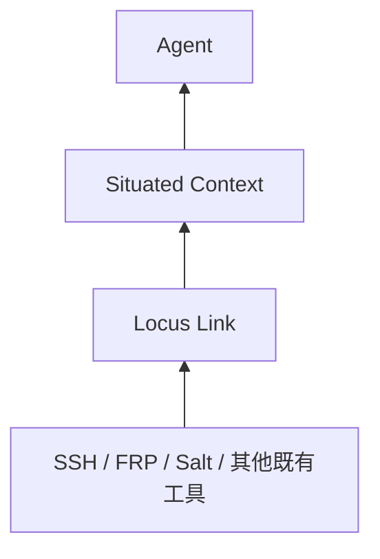

# Locus Link 高层设计

## 1. 核心定义

> **Locus Link 是一层带运行时观测的 situated capability context。它组合明确作用域中的声明、项目绑定、调用现场和运行证据，为 Agent 返回已声明、可解释、带当前证据的操作路径。**

它位于 Agent 与既有机制之间：



它回答：

> 在当前 Project、Environment 和网络位置中，哪些已知方式可以触及目标资源、获得所需能力？这些方式最近是否从相关位置验证过？

```text
Declared Scopes
+ Project Bindings
+ Runtime Context
+ Link Observations
→ Effective View
→ Declared Route Resolution
→ Provider-native Context
```

Locus 不接管原生机制，也不执行 Route。它描述可能性、评估证据并保留原生上下文。

Skill 回答“这类操作怎么做”；Locus 回答“在这里涉及谁、哪条 Route、什么运行证据”。通用教程属于 Skill，易变的环境事实属于 Locus。

## 2. 稳定语义

Locus 的长期领域概念保持有限：

```text
Scope       declaration namespace、ownership 和 lifecycle
Entity      有稳定身份、值得独立引用的资源
Link        通过具体机制获得 operational reachability/capability
Route       人工声明的 ordered Link chain
Binding     Project role 到 canonical Entity 的映射
Context     本次解析所处的调用现场
Observation 某条 Link 在特定 vantage 下的运行证据
```

Capability 首先是 Link 的 `requires/provides` 语义和 Resolve 的查询条件，不必天然成为独立对象。

### 2.1 Entity

Entity 只表示具有稳定身份、值得独立引用和维护的资源。

地址、端口、账号、一次性本地 endpoint、session 或 tunnel context 通常只是 Link/provider 属性。不得为了让 Route 看起来像严格图论路径而制造没有稳定维护价值的 Entity；也不得为了减少 Link 而合并本应独立的真实资源。

### 2.2 Link

Link 只有一个窄语义：

> 从某个 operational context 出发，通过一种具体机制，可以触及一个资源，并因此获得某些 capability。

Link 不是任意关联、归属、事件或因果关系。Workflow、event、causal、ownership 和 Project membership 不进入 Link graph。

Link 保留 provider-specific data。Locus 不把 SSH、FRP、Salt 等异构机制压成通用远程调用 RPC。

### 2.3 Route

Route 是人工声明的 ordered Link chain，表达已经知道、值得复用的 capability composition。Locus 校验、查询、展示和解析 Route，但不从全图自动发明路径。

Route 不要求相邻 Link 严格满足图论上的 `previous.to == next.from`。FRP 后接 SSH 的合法性主要来自：

- 两个 Link 对当前 operational context 均适用；
- 前序 `provides` 满足后序 `requires`；
- 最终 Link 指向请求目标并提供请求能力。

这种定义避免为 localhost endpoint、临时 tunnel 或 session 创建伪 Entity。

因此：

```text
Capability Graph ≠ Workflow Graph
Capability Graph ≠ Action Graph
Capability Graph ≠ 通用知识图谱
```

## 3. Scope、Composition、Binding 与 Identity

### 3.1 Scope

每份声明属于一个有稳定 ID 的 Scope：

```text
Scope
├─ Project
└─ Environment
```

Scope 是 namespace、声明所有权和生命周期边界，不是 Entity。

判断声明归属：

> 如果删除这个 Project，事实仍然成立吗？

- 仍成立：通常属于 Environment，例如共享主机、FRP server 和可复用 Route。
- 不再成立：通常属于 Project，例如项目专用资源、项目特有 Link/Route 和角色 Binding。

不要创建 `project-host`、`environment-host` 等 kind，也不要用 Link 表达 ownership。

### 3.2 Additive Composition

Project 可以显式导入 Environment。声明通过 namespace 归一化后做加法组合：

```text
Project Declarations
+ Imported Environment Declarations
→ Composed Declared View
```

Import 不是 overlay：

- 不做字段 merge；
- 不做 override；
- 不设 project/user/machine precedence；
- imported declaration 不由 Project 就地修改。

需要不同事实时，声明新的 Entity、Link 或 Route，或让 Binding 指向不同 Entity。

### 3.3 Binding

Binding 表达：

```text
Project Role → Canonical Entity
```

Binding 不是 Link，不表示 reachability，也不提供 capability。Project 通常维护“这个角色是谁”；对应 Scope 维护“如何触及它”。

### 3.4 Canonical Identity

Scope ID 稳定，例如 `environment.customer-a`、`project.liaoyu`。对象在 Scope 内使用 local ID；跨 Scope identity 为：

```text
scope-id::local-id
```

Import alias 只缩短引用，不改变 canonical identity。不同 Scope 可以拥有相同 local ID。

## 4. Context 与 Observation

### 4.1 Context

Graph 本身不是 situated 的全部：

```text
Context =
  active scope
  + imported environments
  + bindings
  + runtime facts
  + observations
```

Runtime facts 只保留当前解析真正使用的信息，例如 cwd、可用 Provider 工具和 vantage。新字段必须由真实 CLI 行为或 Vertical Slice 证明需要，不能预先把 Context 扩张成通用 session model。

同一份声明在不同位置可以得到不同 Effective View。

### 4.2 Declaration 与 Observation 分离

Observation 是某条 Link 在特定 vantage 下带时效的运行证据，不是声明事实：

```text
Declared Links
+ Applicable Link Observations
+ Runtime Context
→ Effective Route Evidence
```

Route 状态由其 Link Observation 聚合得到。一次 timeout 不删除 Link；一次成功也不会把推断自动提升为声明。

Observation 使用 canonical Link identity，并记录 vantage。“从位置 A 可达”和“从位置 B 不可达”可以同时为真。

外部系统继续对各自实时状态负责。Provider 只把与声明 Link 有关的状态投影为 Observation，不镜像整个外部系统。

## 5. 知识维护

Locus 保存 curated operational knowledge，不追求自动发现出的完整世界模型。

一条事实值得声明，通常需要同时满足：

```text
实际任务需要
+ 未来可能复用
+ 重新发现存在成本
```

谁建立、修改或真正理解某个 operational relation，谁维护对应 Scope 中的 declaration：

- Environment 维护者负责共享资源和可复用路径；
- Project 维护者负责项目特有事实及 Binding；
- Agent 可以调查并提出 declaration patch，但推断不能自动成为 declared truth；
- Probe 只追加 Observation，不能修改 declaration。

Git 可以承担 diff、review、history 和 rollback；Locus 不重复建设，也不要求使用 Git。

## 6. 产品边界与价值验证

Locus 的输出是 resource resolution、显式 Route、运行证据和 provider-native context。执行、工作流、任务调度、项目生命周期和 Secret 管理由现有系统负责。

核心价值循环：

```text
特殊路径被发现一次
→ 经过审阅成为声明
→ 后续 Agent 直接解析和复用
→ 减少重新阅读文档、配置和历史会话
```

必须用真实 Project/Environment 验证。如果 Locus 不能明显减少 Agent 对项目特定 operational knowledge 的重新发现，只是把 README、AGENTS.md 或 Skill 改写成 YAML 再打印，则应退化为更简单的工具。

## 7. 长期不变量与非目标

长期不变量：

- Scope composition 是 namespaced additive import。
- Binding 只解析 Project role，不提供 capability。
- Identity 使用稳定 Scope ID 和 canonical object ID。
- Link 只表达窄语义 operational capability/reachability。
- Route 显式声明、按顺序组合 Link，但不要求伪造严格节点连续性。
- Declaration 与 Observation 分离；Observation 保留 canonical Link subject 与 vantage。
- Route evidence 从 Link Observation 聚合。
- Locus 返回 provider-native context，不执行 Route。

非目标：

- 自动 path discovery、Planner、Executor、Workflow engine。
- Graph DB、远程 Registry package manager、配置 override/precedence。
- 复杂 Observation Store topology、远程数据库和分布式写入。
- Registry CRUD、Git 管理、RBAC、治理平台、Web UI 和 daemon。
- 自动资产发现、完整数字孪生、Project Manager、Secret Store、RMM、CI/CD 或配置管理平台。

具体 v0 schema、CLI、算法、模块和首个 Vertical Slice 见 [`v0.md`](v0.md)。