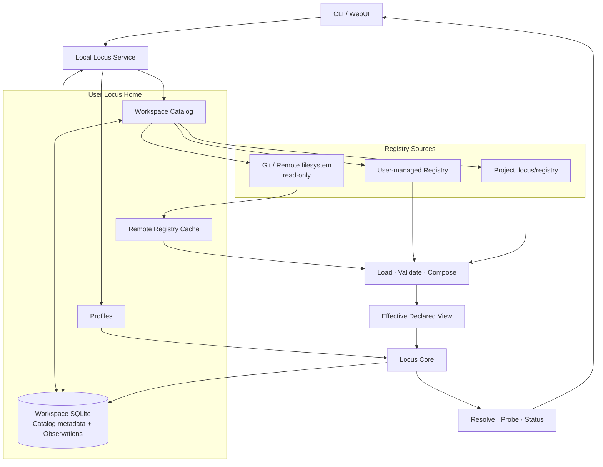

# Locus Workspace 与 Registry 设计

## 简述

Locus 默认作为本机服务运行。每位用户拥有一个 **Locus Home**：它登记多个 Scope 及其 Registry Source，保存项目目录关联、Profile、远程缓存和本地 Observation。项目可以使用用户托管的 Registry，也可以保留自己的 `.locus/registry`；Git 或远程文件系统只提供只读声明，所有 Resolve、Probe 和状态存储仍在本机完成。

本设计的一等公民是 **Scope**。Project、Environment、shared infrastructure 等名称描述 Scope 的角色，不形成不同的对象模型。Scope 与存储位置无关；本地目录、Git URL 和远程文件系统都是承载 Scope 的 Registry Source。

现行 `locus/v0` 公共契约仍使用 Project / Environment kind、相对路径 import 和向上发现。迁移到本文模型时必须显式升级公共 YAML、CLI 和 JSON 契约，不能让既有 Registry 静默改变语义。

## 职责

本文负责：

- 定义 Locus Home、Workspace Catalog、Scope、Registry Source 和 Observation Store 的关系；
- 定义本机多项目管理、项目目录关联、Scope 组合、发现顺序和所有权；
- 定义本地与只读远程 Registry 的统一来源模型；
- 定义 Probe 与本地 Store 的归属。

本文不负责：

- 定义 Entity、Link、Route、Resolve 或 Provider 的领域语义；
- 固定用户目录、SQLite 表、HTTP API 或 Git 命令；
- 设计多租户 Locus Server、远程 Probe、Observation 上报或双向同步；
- 替代公共 CLI 和声明契约。

## 核心概念

| 概念 | 定义 |
| --- | --- |
| **Locus Home** | 当前用户的本地控制面，承载 Catalog、Profile、缓存和 Workspace SQLite。 |
| **Scope** | 声明的所有权、命名空间和组合边界；拥有 Entity、Link、Route、Binding 和 documentation。 |
| **Registry** | 一个 Scope 的声明文件集合。 |
| **Registry Source** | Registry 的来源，例如用户托管目录、项目 `.locus`、Git URL 或远程文件系统。 |
| **Catalog** | 登记 Scope、Source、项目目录关联和已激活 revision；不复制声明。 |
| **Effective View** | active Scope、显式 import 闭包和当前 Profile attachments 组成的规范声明视图。 |
| **Profile** | 本次调用使用的本机设备、用户现场和默认 vantage。 |
| **Observation Store** | 本机 Probe 追加的现实测量历史。 |

## 结构



Catalog 可以知道许多 Scope，但不会把它们全部合并。每次调用只装载当前 active Scope 所需的最小组合。

## Locus Home 与项目 `.locus`

Locus Home 是逻辑上的用户级入口，物理位置遵循操作系统配置和状态目录。它至少提供：

- Scope 与 Registry Source 登记；
- 项目目录到 active Scope 的关联；
- Profile、远程缓存和本地 Observation；
- WebUI 的多项目入口。

项目 Registry 有两种等价的存储方式：

- **managed**：声明位于 Locus Home，Catalog 将项目目录映射到对应 Scope；不修改项目文件；
- **embedded**：声明位于项目的 `.locus/registry`，适合随仓库审阅和分发。

二者使用同一 Scope 与 Registry schema，不做互相覆盖。同一项目同时命中不同 managed 和 embedded Scope 时必须报告冲突。

查找顺序为：

1. 调用方显式指定的 Workspace、Scope 或 Registry Source；
2. 从 cwd 向上找到最近的 embedded `.locus`；
3. Catalog 中与 cwd 最长目录前缀匹配的 managed Project association；
4. 进入 Locus Home，但需要 active Scope 的操作必须要求用户选择或注册项目。

Locus Home 不是自动合并到所有项目的全局 Scope。

## Identity 与所有权

单一 Locus Home 内：

- `scope_id` 唯一；不同 source 声称同一 `scope_id` 时拒绝，不设置 precedence；
- Scope 内 local object ID 唯一；canonical object identity 保持 `<scope-id>::<local-id>`；
- import alias 只需在声明它的 Scope 内唯一；
- source URL、缓存路径、认证和 revision 不进入 Scope identity；
- 需要隔离的同名 Scope 使用明确的 namespace 前缀形成不同 `scope_id`。

所有权保持单向：

| 对象 | 所有者 |
| --- | --- |
| Catalog、Profile、cache、Workspace SQLite | Locus Home |
| Entity、Link、Route、Binding、documentation | 所属 Scope |
| managed Registry | Locus Home |
| embedded Registry | 项目目录 |
| remote Registry | 远程 source；本机只持有已校验缓存 |
| Observation | 执行 Probe 的本机 Locus Home |

Import 只引用 Scope，不复制声明，也不改变 imported Scope 的所有权。

## Registry Source

Catalog 使用统一来源记录管理本地与远程 Registry：

```text
source_id
scope_id
source_kind      managed | file | git | remote-filesystem
source_uri       不包含凭据
credential_ref   可选，仅保存在 Locus Home
revision         可选
cache_location   本机实现细节
```

`source_id` 区分同一 URL 的不同注册；认证变化不改变 Scope identity。远程 source 首期只读，获取后必须：

1. 放入本地缓存；
2. 严格解码并验证实际 `scope_id`；
3. 验证引用、Provider data 和 documentation containment；
4. 完整校验成功后才激活新 revision；
5. 保留当前已激活 revision，不能因更新失败破坏现有视图。

Secret、token 和密码不进入 source URI、Registry、缓存元数据或 Observation；Catalog 只保存 opaque credential reference。

## Scope 组合

```text
Effective View
  = active Scope
  + transitive explicit imports
  + selected Profile attachments
```

组合规则：

- import 形成无环 Scope DAG；
- 组合是 namespaced additive composition，不 merge、override 或猜测 precedence；
- 同一个 Scope 经多条路径引入时稳定去重；
- Catalog 中未被引用的 Scope 不进入 Effective View；
- Scope role 只影响策略和展示，不建立 Project / Environment 两套领域模型；
- Profile attachment 表示本次设备和用户现场，不替代项目必须声明的持久依赖；
- Effective View 必须保留每个 Scope 的 source、import 和 attachment provenance。

Core 只消费经过严格解码、引用归一化和完整校验的 Effective View，不负责发现目录、下载 Git 或选择认证。

## Workspace SQLite 与 Probe

Workspace SQLite 可以同时承载 Catalog metadata 和 Observation，但声明始终保存在 Registry 文件中，不复制进数据库。

所有 Probe 都在本机执行并写入本机 Store，无论 Link 声明来自 managed、embedded 还是 remote source：

```text
Registry declaration
→ local Provider Safe Probe
→ sanitized Observation
→ local Workspace SQLite
```

Observation 至少按以下上下文隔离：

```text
canonical Link identity
+ declaration digest
+ Profile
+ vantage
```

声明 digest 不匹配的历史记录不得证明当前 Link。Route evidence 继续从当前 Effective View 中的 Link Observations 动态聚合，不持久化 Route status。

远程仓库不保存 Probe 配置之外的运行状态，不接收 Observation，也不注册整个用户 Locus Home。未来若引入远程服务或 Observation 上报，必须建立独立的 authority、认证和同步设计。

## 初始化与注册

`init` 的逻辑动作是：

1. 创建 managed 或 embedded Registry；
2. 写入最小 Scope 声明和目录；
3. 完整校验；
4. 将 Scope、Source 和可选项目目录关联登记到当前 Locus Home。

已有本地或远程 Registry 使用同一 Catalog 注册流程：本地记录 file source，远程记录 Git 或 remote-filesystem source。创建 Registry 与登记 Source 是两个职责；CLI 可以在一次命令中连续完成，但实现不能把二者混成不可分割的文件写入。

## 验证不变量

- 项目可以完全不包含 `.locus`，仍能通过 managed association 使用 Locus；
- embedded Registry 可以脱离原用户 Catalog 独立校验；
- 同一 Scope 的本地、缓存和远程位置变化不改变 canonical object identity；
- 未被 import 或 attach 的 Scope 不进入当前 Graph、Resolve 或 Status；
- remote source 不写 Observation，所有 Probe 结果留在本机 Workspace SQLite；
- Catalog、API、错误和日志不得暴露 credential value；
- 远程更新失败不替换最后一个有效 revision；
- 测试中的 Home、cache、helper 和 SQLite 必须全部重定向到工作区。
