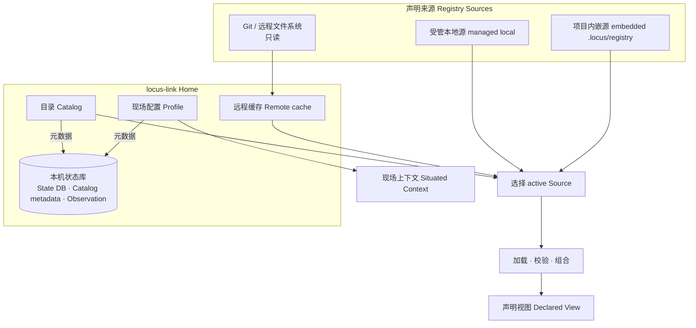

# locus-link Home 与 Registry 设计

## 简述

locus-link 是 concrete environment / situated operational knowledge layer。它在本机发现并组合可审阅的 Scope 声明，结合当前现场和 Observation，回答具体资源是谁、已知路径是什么、当前证据支持到什么程度，以及应绑定哪个 native 或 MCP capability provider。

本文不建立持久化 `Workspace` domain object。历史文件名保留以避免链接迁移；正文统一使用 **locus-link Home、Catalog、Scope、Registry、Registry Source、Declared View、Situated Context** 和 **Effective View**。

现行 `locus/v0` 仍只实现 embedded Registry、相对路径 import 和向上发现。本文中的 Home Catalog、managed/remote source、Profile 和 authority switch 是目标设计；迁移必须显式升级公共 YAML、CLI 或 JSON 契约，不能静默改变现有 Registry。

## 职责

本文负责：

- 定义 locus-link Home、Catalog、Scope、Registry、Registry Source 和本机 State DB 的关系；
- 定义 active Scope 发现、单一权威 Source、显式 import 与来源 provenance；
- 分离确定性的 Declared View 与调用时 Situated Context；
- 定义 Profile、远程 revision 和本地 Observation 的边界。

本文不负责：

- 定义 Entity、Binding、Link、Route、Resolve 或 Provider 的内部语义；
- 固定用户目录、SQLite schema、HTTP API 或 Git 命令；
- 设计多租户服务、远程 Probe、Observation 上报、双向同步或 source precedence merge。

## 名词表

| 名词 | 定义 |
|---|---|
| **locus-link Home** | 当前用户的本地状态根目录；承载 Catalog、Profile、远程缓存和 locus-link State DB。 |
| **Catalog** | Scope source registration、项目目录关联、Profile metadata 与 active revision 元数据；不复制声明。 |
| **Scope** | 声明的 ownership boundary、namespace 和 composition boundary。 |
| **Registry** | 一个 Scope 的 Entity、Binding、Link、Route 和 documentation 声明集合。 |
| **Registry Source** | Registry 的物理来源，例如 embedded/managed 本地目录、Git 或远程文件系统。 |
| **Declared View** | active Scope 加显式 transitive imports 形成的确定性声明视图。 |
| **Situated Context** | Profile、当前 actor/entity、vantage、本机 provider availability 和相关 runtime facts。 |
| **Effective View** | Core 一次调用实际消费的 `Declared View + Situated Context`，并保留各自 provenance。 |
| **Profile** | “我是谁、目前在哪里”的本机默认现场；不拥有或注入普通声明。 |
| **locus-link State DB** | Home 级 Catalog metadata 与本机 Observation 的实现载体；不是声明来源。 |

## 长期不变量

```text
Scope
= ownership boundary
+ namespace
+ composition boundary

Registry
= one Scope's declaration set

Registry Source
= physical origin of that Registry

canonical identity != source location
```

`environment.customer-a::host.prod-01` 从 embedded local 迁移到 managed local 或 Git 后 identity 不变。Source URI、缓存路径、credential 和 revision 均不进入 canonical identity。

## 结构与边界



Catalog 可以登记许多 Scope，但一次调用只装载 active Scope 的显式 import closure。locus-link Home 不是自动并入每个项目的全局 Scope。

## Scope、Registry 与单一权威 Source

单一 locus-link Home 内，一个 Scope 在任一时刻最多有一个 **active authoritative Registry Source**。当前 v0 遇到多个 Source 同时声称同一 `scope_id` 可以直接报冲突；目标模型将 Source 迁移理解为 authority switch，而不是 precedence merge：

```text
Scope
├─ active authoritative source
├─ candidate source             # deferred
└─ historical/cache revision    # deferred
```

本轮不实现 candidate 管理或切换协议。确定规则是：

- `scope_id` 在一个 Home 内唯一；
- active Source 提供该 Scope 当前唯一权威声明；
- 不把多个 Source merge、override 或按优先级叠加；
- authority switch 必须先完整获取、校验并原子激活新 Source/revision；
- 切换 Source 不改变 Scope 或 object canonical identity；
- 更新失败继续使用最后一个有效 authoritative revision。

Project、Environment 和 shared infrastructure 是 Scope 的角色或 lifecycle 分类，不形成不同领域模型。Scope 内 local ID 唯一，canonical ID 固定为 `<scope-id>::<local-id>`。

## Declared View 与 Situated Context

```text
Declared View
= active Scope
+ transitive explicit imports

Situated Context
= selected Profile
+ current actor/entity
+ vantage
+ local provider availability
+ relevant runtime facts

Resolve(DeclaredView, SituatedContext, applicable Observations)
```

Declared View 必须可审阅、确定且可由 Registry 独立重建：

- imports 显式、additive，并形成 DAG；
- 同一 Scope 经多条路径引入时稳定去重；
- import 不复制或修改 imported declaration ownership；
- 不支持隐式 merge、override、多 Source precedence；
- Catalog 中未被 import 的 Scope 不进入 Declared View。

Profile 只提供现场默认值和 provenance，例如：

```yaml
profile: office-dev
actor: workstation.dev-a
vantage: office-lan
```

Profile 不作为第二套 import 系统，也不能任意注入 Entity、Binding、Link 或 Route。Project 必需的 Environment dependency 必须由显式 Scope import 声明，不能依赖某台机器恰好选中的 Profile。机器专有且需要持久审阅的声明应放入独立 Scope；具体 executable、配置路径或 localhost endpoint 等 workstation-local mechanism binding 作为严格受限的 Situated Context 输入，按 Link identity 覆盖 concrete Provider binding，不进入 Registry 或 Graph。Profile 将来只能为这类输入提供默认选择，不能改变其数据归属。

## active Scope 发现

显式选择优先，implicit discovery 不使用 first-match precedence：

```text
1. --scope / --registry 等显式选择存在：
   使用显式选择并校验，不再参与 implicit candidate 竞争。

2. 否则收集全部 implicit candidates：
   - cwd 向上最近的 embedded candidate
   - Catalog 中最长目录前缀的 managed association candidate

3. 选择：
   0 candidates  → 进入 Home；需要 Scope 的操作报告 no active Scope
   1 candidate   → 选择并校验
   >1 candidates → 相同 authority 可去重；不兼容候选显式报冲突
```

managed 与 embedded 不得静默覆盖。何谓“相同 authority”的最小比较键在实现 discovery contract 时确定；默认保守行为是不能证明相同即冲突。

## Registry Source 与不可变 provenance

Catalog 的目标来源记录至少表达：

```text
source_id
scope_id
source_kind          managed | file | git | remote-filesystem
source_uri           no credentials
credential_ref       optional, Home only
requested_revision   optional mutable selector, e.g. main
resolved_revision    immutable commit/hash/revision
content_digest       digest of validated Registry content
cache_location       implementation detail
```

远程 source 首期只读，更新流程固定为：

```text
download
→ isolated cache
→ strict decode and validate
→ verify scope_id and documentation containment
→ record resolved_revision + content_digest
→ atomic activate
```

Effective View 和 diagnostics 必须能回答 `scope_id / source / requested_revision / resolved_revision / content_digest`。`main`、tag 或其他 mutable selector 只能作为 requested revision；实际运行必须追溯到不可变 revision 和内容 digest。

Secret、token 和密码不进入 Source URI、Registry、cache metadata、Effective View 或 Observation。Catalog 只保存 opaque credential reference。

## 本机 State 与 Observation 归属

声明始终保存在 Registry，不复制到 locus-link State DB。无论声明来自 managed、embedded 或 remote Source，Probe 都在本机执行并写入当前 Home 的 Observation Store：

```text
Registry declaration
+ Situated Context
→ native or MCP Provider Safe Probe
→ sanitized Observation
→ local locus-link State DB
```

Observation applicability 的详细键由[基础系统设计](base-系统设计.md#observation-与-evidence)定义。Profile ID 可以作为 provenance 保存，但不能整体充当 validity key；只有真正影响 Probe 语义的 context fingerprint 参与适用性判断。

远程 Registry 不接收 Observation，也不注册整个 Home。

## 初始化与注册

`init` 与 Catalog registration 是两个职责：

1. 创建 managed 或 embedded Registry；
2. 写入最小 Scope 声明和目录；
3. 完整校验；
4. 可选地将 Scope、Source 和项目目录关联登记到当前 Home。

CLI 可以连续执行两者，但实现不能把 Registry 文件创建与 Home metadata 写入绑定成不可分割操作。已有本地或远程 Registry 使用同一 registration 概念。

## 验证不变量

- 项目可以不包含 `.locus`，仍能通过 managed association 使用 locus-link；
- embedded Registry 脱离原用户 Catalog 仍可独立校验；
- Scope Source 位置或 authority switch 不改变 canonical identity；
- Declared View 只由 active Scope 与显式 import DAG 决定；Profile 变化不增加普通声明；
- embedded 与 managed implicit candidates 冲突时不静默选择；
- 每个 Scope 只有一个 active authoritative Source，不存在 precedence merge；
- remote activation 可追溯到 immutable resolved revision 与 content digest；
- remote source 不写 Observation，全部 Probe 结果留在本机 locus-link State DB；
- Catalog、API、错误和日志不得暴露 credential value；
- 测试中的 Home、cache、helper 和 State DB 必须全部重定向到工作区。
