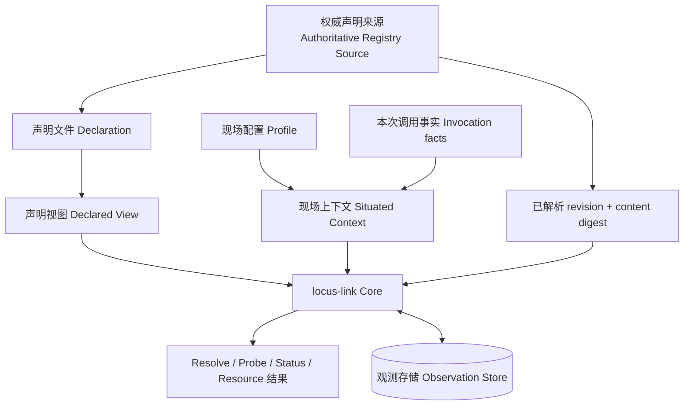
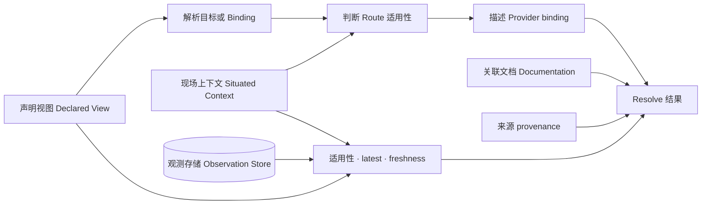
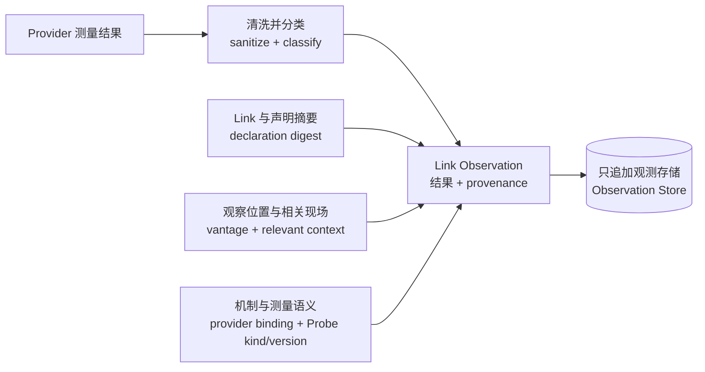

# locus-link 数据设计

## 简述

本文定义 Registry declaration、Source provenance、Declared View、Situated Context、Provider result、Observation 和公共结果的数据血缘与持久化边界。locus-link 只持久化 concrete environment knowledge 与本机 evidence；MCP transport、server metadata、auth 和 lifecycle 不成为新的 locus-link truth source。

公共字段见[公共契约](contracts/README.md)，Scope/Source 语义见[基础 Home 与 Registry 设计](base-Home与Registry设计.md)，处理语义见[基础系统设计](base-系统设计.md)，当前文件与 SQLite 实现见[当前实现快照](../current-architecture.md)。

## 职责

本文负责：

- 定义数据来源、ownership、派生、持久化和消费者；
- 定义 declaration/source、Situated Context、Observation 与结果的 provenance；
- 定义 Secret、remote revision 和 Provider output 的安全边界；
- 约束失败时哪些数据允许持久化。

本文不负责固定 Registry layout、SQLite schema、MCP protocol、Git 命令或当前 Provider 实现。

## 数据分类

| 数据 | 权威来源 | 主要变换 | 持久化 | 消费者 |
|---|---|---|---|---|
| Registry declaration | active authoritative Registry Source | strict decode、canonicalize、validate | Source files | Core |
| Source provenance | Catalog + fetch/validation | resolve revision、content digest、atomic activation | Home metadata | Loader、diagnostics |
| Declared View | active Scope + explicit import DAG | namespaced additive composition | 派生；可缓存 | Resolver、Probe |
| Profile | 用户本机配置 | 选择默认 actor/vantage | locus-link Home | Context builder |
| Situated Context | Profile + invocation + local facts | normalize、fingerprint relevant facts | 一次调用 | Resolve、Probe |
| Provider binding | Link declaration | validate、describe native/MCP invocation | 随声明 | Resolve、Probe |
| Safe Probe result | native/MCP Provider binding | sanitize、classify | 不直接持久化 | Probe orchestration |
| Link Observation | Probe result + provenance | append immutable record | Observation Store | Resolve、Status |
| Link/Route evidence | latest applicable Observations | validity、freshness、aggregation | 不持久化 | Resolve、Status |
| Documentation | Registry Source | containment、association、按需读取 | Source files/cache | CLI、WebUI、MCP Resource |
| Secret value | 外部 credential/auth 机制 | 由 native 或 MCP ecosystem 使用 | 不进入 locus-link stores | 外部 mechanism |

Profile 不派生 Declared View。

## 持久化与 truth sources



当前持久事实分三类：

1. authoritative Registry Source 中的 Declaration 与 documentation；
2. Home Catalog 中的 Source registration、immutable resolved revision/content digest 与 Profile metadata；
3. 本机 Observation Store 中 append-only evidence。

Declared View、Situated Context、provider invocation description、Link/Route evidence 和公共结果都是派生数据，不成为第二个 truth source。缓存可以保存已验证内容，但权威性来自 active Source + immutable provenance，不来自缓存路径。

## Declaration 与 Source provenance

```text
Registry Source
→ requested revision
→ resolved immutable revision
→ validated content digest
→ Scope ownership
→ canonical identity/reference normalization
→ explicit additive imports
→ Declared View
```

必须保留：

- local ID 与 `<scope-id>::<local-id>` canonical identity；
- Binding role 与 canonical target；
- declaration owning Scope；
- authoritative `source_id/source_uri`；
- `requested_revision` 与实际 `resolved_revision`；
- validated `content_digest`；
- import path/alias provenance。

Mutable branch/tag 不能单独证明运行内容。Source 从 local 迁移到 Git 时 canonical identity 不变；resolved revision/content digest 改变时 diagnostics 必须可比较前后 View。

严格解码、identity、import DAG、reference、Provider binding 或 documentation containment 任一步失败时：

- 不激活部分 View 或新 remote revision；
- 保持最后一个有效 active revision；
- 不读取或写入 Observation 来掩盖声明错误；
- 不启动 native executable 或调用 MCP tool。

## Declared View 与 Situated Context 血缘

```text
Declared View
  ← active Scope
  ← explicit transitive imports

Situated Context
  ← optional selected Profile provenance
  ← current actor/entity
  ← vantage
  ← local native/MCP provider availability
  ← Provider 明确需要的 runtime facts
```

Project dependency 只能通过 import 进入 Declared View。Profile 或本机 availability 变化只影响 Situated Context，不增加、覆盖或删除普通 Entity、Binding、Link、Route。

Core 结果必须分别指出声明 provenance 与现场 provenance，避免把“声明不存在”和“当前现场不可用”混为一类。

## Resolve 数据流



Resolve 不写任何持久数据，也不执行 native/MCP capability。每个结果可追溯到 target/Route/Link、authoritative Source revision、Situated Context 和逐 Link evidence。

## Probe 与 Observation 数据流



Observation 只能在形成实际测量结果后追加。声明/binding 错误、测量尚未开始的系统错误或 Store append 失败均不能伪造 success/failure evidence。Route 后续未尝试的 Link 不写记录；已成功 append 的前序事实不因整体命令后续失败而回滚。

### Observation record 血缘

Observation 的适用性与 Route evidence 语义由[基础系统设计的 Link Observation](base-系统设计.md#link-observation)统一定义。本文只约束各记录字段从哪里产生：

| 记录信息 | 来源 |
|---|---|
| canonical Link、declaration digest | 本次 Probe 使用的 validated Declared View |
| vantage、relevant context fingerprint、Profile provenance | 本次 Situated Context |
| provider binding、Probe kind/version | validated mechanism binding 与 SafeProbe contract |
| status、时间、期限、evidence/error | sanitized measured result 与 Probe orchestration |

这些信息必须在测量时一起形成，Store 不根据当前 Registry 或 Profile 反向补齐历史记录。记录追加后保持不可变；查询结果中的 latest、freshness、Observation overlay 和 Route evidence 均为读取时派生。
适用记录必须同时匹配 canonical Link、vantage、declaration digest、Source content digest、effective mechanism binding digest、Probe kind/version 和 relevant context fingerprint；任一字段不同都不能作为当前 Evidence。Context fingerprint 只包含 Provider 明确声明会影响测量语义的字段，CWD 等无关字段不得导致失效。

当前 SQLite 迁移为既有表追加上述 provenance columns。迁移前的历史行缺少完整 provenance，保留用于历史检查，但不会匹配新的 applicability query；不猜测或反向补齐旧记录。workstation-local mechanism binding 的 executable 与覆盖后的 `provider_data` 共同参与 binding digest，binding 文件路径本身不参与语义 identity。


## Documentation 与 MCP Resource

Documentation reference 保留 owning Scope、canonical subject、normalized ref、Source revision 和 content digest。正文只从所属 Scope `docs/` containment 内按需读取；不复制到 Observation Store，也不从 Markdown 推导 capability、credential 或 Route。

locus-link MCP 可以把关联文档映射为 `locus://docs/{id}` Resource，实现 progressive disclosure。

## Provider 与 MCP 数据边界

locus-link native binding 可以保存 adapter-specific config 和 opaque credential ref；MCP binding 只保存 server/tool reference 及 locus-link Link 所需的最小 binding data。

Provider output 先 sanitize 再形成 Observation。任意 stdout/stderr、MCP tool raw error、Secret value 和未白名单远端 payload 不进入公共结果、Store、错误或日志。

## Ownership

| 数据 | Owner | 修改方式 |
|---|---|---|
| Declaration/documentation | owning Scope maintainer | 修改 authoritative Registry，重新校验 |
| Source registration/authority | locus-link Home user | 显式 register/switch，原子激活 |
| Profile | locus-link Home user | 修改现场默认值，不影响 Declared View |
| Situated Context | caller/context builder | 一次调用派生，不持久化为 declaration |
| Observation | Probe orchestration | append 新记录，不原地改写 |
| Route evidence | Resolver | 每次查询重新计算 |
| Secret value | 外部 credential/MCP auth mechanism | 不经过 locus-link Store |

Agent 调查得到的新环境事实必须形成可审阅 declaration patch；Observation、Profile 或 MCP response 不自动反向修改 Registry。

## 验证口径

至少证明：

- Source 迁移不改变 canonical identity；remote result 可追溯到 immutable revision/content digest；
- Declared View 只受 active Scope 与显式 import DAG 影响，Profile 不注入声明；
- embedded/managed candidate 冲突不静默覆盖；
- Resolve 不写 Registry、Catalog 或 Observation；
- Probe 只为实际测量的 Link append；
- declaration digest、vantage、provider binding、Probe kind/version 和 relevant context 共同决定 applicability；
- Profile 无关设置变化不使 Observation 失效；
- Secret 和 raw process/MCP output 不进入 locus-link stores 或公共结果；
- E2E Registry、Home、helper、cache 和 State DB 全部位于工作区。
