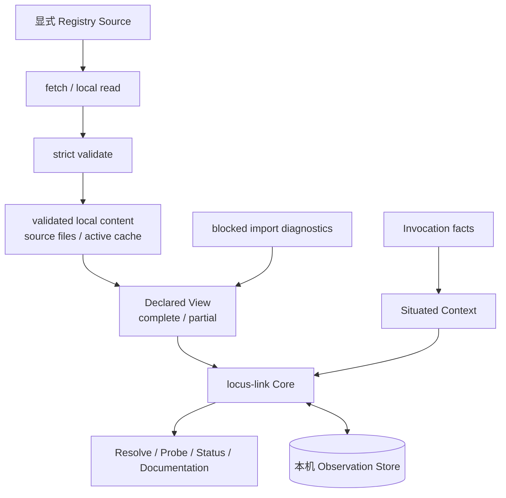
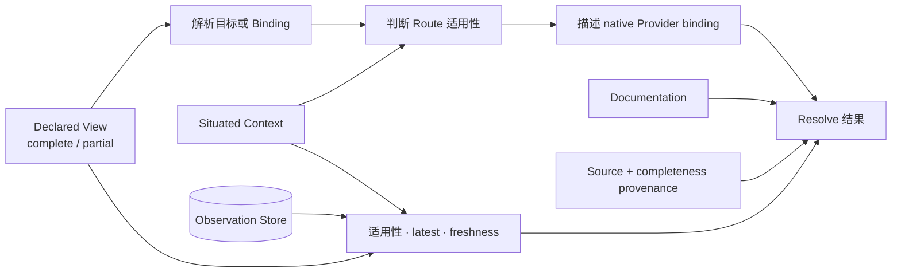
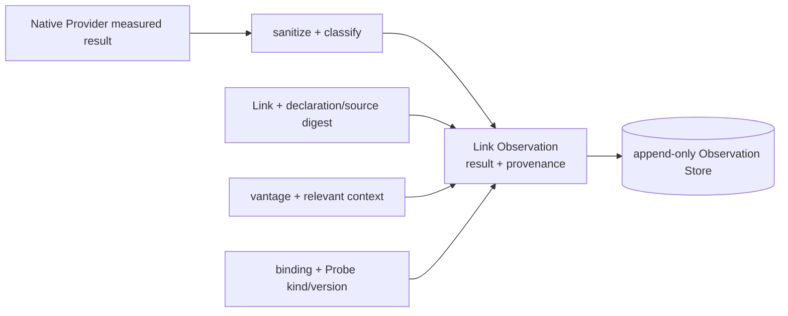

# locus-link 数据设计

## 简述

本文定义 Registry declaration、Source provenance、Declared View、Situated Context、native Provider result、Observation 和公共结果的数据血缘与持久化边界。locus-link 只持久化可审阅的声明、用户级 Source/cache metadata 和本机 evidence；派生视图、Secret value 与未经清洗的外部输出不成为新的 truth source。

Scope、Registry、Source 与 import graph 见[基础 Scope 设计](base-Scope设计.md)，用户根入口、项目登记、remote cache 和本机状态见[用户级 Locus 设计](base-用户级Locus设计.md)，处理语义见[基础系统设计](base-系统设计.md)，公共字段见[公共契约](contracts/README.md)，当前文件与 SQLite 实现见[当前实现快照](../current-architecture.md)。

## 职责

本文负责：

- 定义数据来源、ownership、派生、持久化和消费者；
- 定义 declaration/source、Declared View completeness、Situated Context、Observation 与结果的 provenance；
- 定义 Secret、remote revision、缓存和 Provider output 的安全边界；
- 约束失败时哪些数据允许持久化。

本文不负责固定 Registry layout、SQLite schema、Git/HTTP 命令、缓存目录或当前 Provider 实现。

## 数据分类

| 数据 | 权威来源 | 主要变换 | 持久化 | 消费者 |
|---|---|---|---|---|
| Registry declaration | 显式 Import 选择的 validated Registry Source | strict decode、canonicalize、validate | Source files/active cache | Graph collector、Core |
| Source provenance | Import + fetch/validation | resolve commit、content digest、atomic activation | 用户级 Source/cache metadata | Loader、diagnostics |
| Declared View | 根 Scope + 成功收集的显式 imports | namespaced composition、去重、回边阻断 | 派生；可缓存 | Resolver、Probe |
| Blocked import diagnostics | graph collection | classify cycle/conflict/fetch/validation failure | refresh metadata；调用结果 | CLI、WebUI、Core |
| Project registration | 用户显式登记 | Scope/source/path association | 用户级登记表 | 根 Scope discovery |
| Situated Context | invocation + local facts | normalize、fingerprint relevant facts | 一次调用 | Resolve、Probe |
| Provider binding | Link declaration + workstation-local override | validate、describe native invocation | 声明与本机配置各自持有 | Resolve、Probe |
| Safe Probe result | native Provider | sanitize、classify | 不直接持久化 | Probe orchestration |
| Link Observation | measured result + provenance | append immutable record | Observation Store | Resolve、Status |
| Link/Route evidence | latest applicable Observations | validity、freshness、aggregation | 不持久化 | Resolve、Status |
| Documentation | Registry Source | containment、association、按需读取 | Source files/active cache | CLI、WebUI、Agent |
| Secret value | Git/HTTP/native credential mechanism | 由外部工具使用 | 不进入 locus-link stores | 外部工具 |

## Truth sources 与本机状态



持久事实只有三类：

1. 各 Scope Registry Source 中的 Declaration 与 documentation；
2. 用户级 Locus 中的项目登记、Source/cache metadata、最后有效 remote revision 和 refresh diagnostics；
3. 本机 Observation Store 中 append-only evidence。

Declared View、Situated Context、native invocation description、Link/Route evidence 和公共结果均为派生数据。Remote cache 是显式 Source 内容的最后有效本机物化，不产生第二个 Scope，也不以缓存路径定义权威性。

## Declaration 与 Source provenance

```text
explicit Import
→ Source locator
→ local content or fetched candidate
→ resolved commit/content digest
→ strict Registry validation
→ Scope ownership and canonical identity
→ graph collection
→ Declared View
```

必须保留：

- local ID 与 `<scope-id>::<local-id>` canonical identity；
- Binding role 与 canonical target；
- declaration owning Scope；
- import alias path 和 Source locator；
- Git requested revision 与 resolved commit；
- URL/local validated content digest；
- 当前使用 active cache 还是直接本地 Source；
- refresh error 与继续使用的最后有效 provenance。

Mutable Git branch/tag 不能单独证明运行内容。Source 从目录迁移到 Git 或 URL 时 canonical identity 不变；resolved commit/content digest 变化时 diagnostics 必须能够比较前后内容。

Registry 自身的严格解码、identity、reference、Provider binding 或 documentation containment 失败时：

- candidate 不得激活；
- 已有 active cache 保持不变；
- 不执行该 Registry 中的 Link Probe；
- 不读取或写入 Observation 来掩盖声明错误。

一个 Registry 校验成功而其下游 import 被阻断时，该 Registry 自身可以激活并进入 partial Declared View。Blocked edge 单独记录，不把已校验节点误判为无效。

## Declared View 与完整性

```text
Declared View
  ← explicit root Scope
  ← successfully collected transitive imports
  ← scope_id deduplication
  ← blocked back/conflict/unavailable edges
```

Declared View 必须携带：

```text
completeness: complete | partial
loaded scope/source provenance
blocked import paths and reasons
```

Partial view 中的已加载声明仍可查询和 Probe，但候选集合不完整。Resolve 可以返回已找到的 Route，同时必须保留 `partial`；不得把“当前未发现”表述为全图不存在，也不得把单一已发现 Route 表述为全图唯一。

项目依赖只能通过显式 import 进入 Declared View。项目反向登记、用户级 cache metadata、本机 availability 和 Observation 均不能增加、覆盖或删除普通 Entity、Binding、Link、Route。

## Situated Context 血缘

```text
Situated Context
  ← current entity / from
  ← vantage
  ← local native provider availability
  ← workstation-local mechanism binding
  ← Provider 明确需要的 runtime facts
```

Profile 与独立 actor 语义当前冻结。Context 只影响 invocation description、Route 适用性和 Observation applicability，不成为 Declaration。

Core 结果必须分别指出声明/Source provenance、Declared View completeness 与现场 provenance，避免把“声明不存在”“import 被阻断”和“当前现场不可用”混为一类。

## Resolve 数据流



Resolve 不写 Registry、项目登记、cache metadata 或 Observation，也不执行 native capability。普通 Resolve 不访问网络。每个结果可追溯到 target/Route/Link、Source revision/content digest、Declared View completeness、Situated Context 和逐 Link evidence。

## Probe 与 Observation 数据流



Observation 只能在一条已加载、完整校验的 Link 形成实际测量结果后追加。声明/binding 错误、blocked import、测量尚未开始的系统错误或 Store append 失败均不能伪造 success/failure evidence。Route 后续未尝试的 Link 不写记录；已经成功 append 的前序事实不因后续失败而回滚。

### Observation record 血缘

| 记录信息 | 来源 |
|---|---|
| canonical Link、declaration digest | 本次 Probe 使用的 validated declaration |
| Registry Source content digest | owning Scope 当前使用的 validated Source/active cache |
| vantage、relevant context fingerprint | 本次 Situated Context |
| effective provider binding、Probe kind/version | validated native binding 与 SafeProbe contract |
| status、时间、期限、evidence/error | sanitized measured result 与 Probe orchestration |

这些信息必须在测量时一起形成，Store 不根据当前 Registry 反向补齐历史记录。记录追加后保持不可变；latest、freshness、Observation overlay 和 Route evidence 均在读取时派生。

适用记录必须同时匹配 canonical Link、vantage、declaration digest、Registry Source content digest、effective mechanism binding digest、Probe kind/version 和 relevant context fingerprint。任一字段不同都不能作为当前 Evidence。Context fingerprint 只包含 Provider 明确声明会影响测量语义的字段；CWD 等无关字段不得导致失效。

既有 SQLite 迁移可以 additive 地增加 provenance columns。缺少完整 provenance 的旧记录保留用于历史检查，但不匹配新 applicability query；不得猜测或反向补齐。Workstation-local binding 的 executable 与覆盖后的 provider data 共同参与 binding digest，binding 文件路径本身不参与语义 identity。

## Documentation 数据边界

Documentation reference 保留 owning Scope、canonical subject、normalized ref、Source resolved commit/content digest 和 association。正文只从所属 Scope `docs/` containment 内按需读取；不复制到 Observation Store，也不从文档推导 capability、credential、Route 或 Provider binding。

文档可以描述 native 或 MCP 操作。此类内容对 locus-link 是 opaque documentation：Core 不解析、实例化或执行其中的 MCP 功能，也不建立 MCP Adapter、Provider、Resource 或 SafeProbe 数据模型。

## Provider 与 Secret 边界

Native binding 可以保存 adapter-specific config 和 opaque credential reference。Provider output 必须先 sanitize 再形成 Observation。

以下数据不得进入公共结果、Store、cache metadata、错误或日志：

- Secret value；
- arbitrary stdout/stderr；
- 未白名单远端 payload；
- Source URI 中的 credential；
- native tool raw error。

错误只保留操作名、稳定失败类别和 Provider 明确解析并列入白名单的非敏感字段。实际认证由 Git、HTTP、SSH Agent、Credential Manager、Vault、环境变量等外部机制负责。

## Ownership

| 数据 | Owner | 修改方式 |
|---|---|---|
| Declaration/documentation | owning Scope maintainer | 修改 Registry Source，重新校验 |
| Import/Source locator | importing Scope maintainer | 修改显式 Import |
| Project registration | 用户级 Locus | 显式登记、更新或移除引用 |
| Active cache/revision | 用户级 refresh orchestration | 获取、校验、原子激活 |
| Situated Context | caller/context builder | 一次调用派生 |
| Observation | Probe orchestration | append 新记录，不原地改写 |
| Route evidence | Resolver | 每次查询重新计算 |
| Secret value | 外部 credential mechanism | 不经过 locus-link Store |

Agent 调查得到的新环境事实必须形成可审阅 declaration patch；Observation、项目登记、cache metadata 或文档内容不自动反向修改 Registry。

## 验证口径

至少证明：

- Source 迁移不改变 canonical identity；Git/URL 内容可追溯到 resolved commit/content digest；
- Declared View 只受根 Scope 与显式 import graph 影响，按 `scope_id` 去重并阻断回边；
- blocked edge 形成 partial diagnostics，不使其他已校验 Scope 失效；
- partial Resolve 不声称候选集合完整；
- 项目反向登记不注入声明；
- 普通 Resolve 不访问网络，也不写 Registry、登记表、cache metadata 或 Observation；
- refresh 校验成功后才原子激活，失败继续使用最后有效缓存；
- Probe 只为实际测量的已校验 Link append；
- declaration/source digest、vantage、provider binding、Probe kind/version 和 relevant context 共同决定 applicability；
- Secret 和 raw process/remote output 不进入 locus-link stores 或公共结果；
- E2E Registry、用户级 Locus、helper、cache 和 State DB 全部位于工作区。
