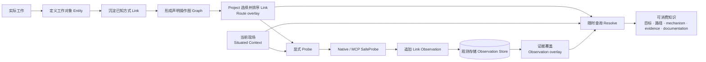
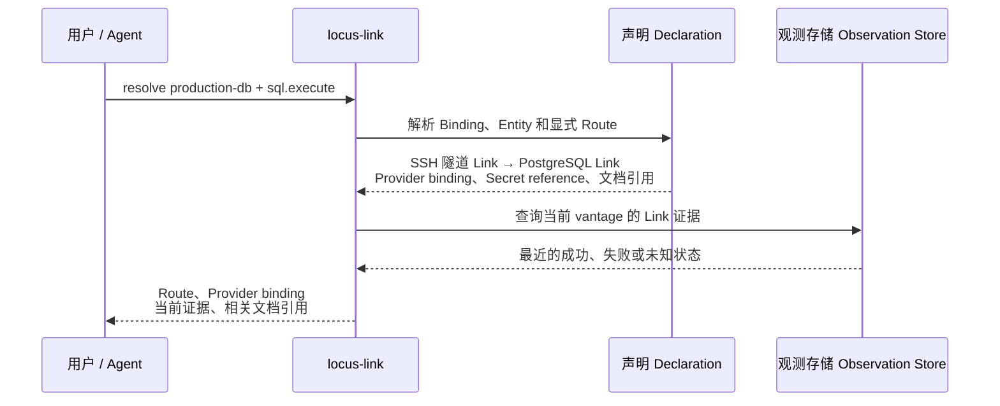

# locus-link 核心概念

## 简述

locus-link 描述异构环境中“如何获得某种 operational capability”的已知链路，使人和 Agent 能从语义目标理解已有操作路径、具体机制、现实证据和相关上下文。

- 当前实现见[当前实现快照](../current-architecture.md)
- 用户和 Agent 依赖的接口见[公共契约](contracts/README.md)
- 整体组件关系见[基础系统设计](base-系统设计.md)
- 测试基准与关键样例见[测试设计](测试设计.md)
- MCP 分层背景见 [`documents/reference/locus-link 与 MCP.md`](../reference/locus-link%20与%20MCP.md)

## 职责

- 解释 locus-link 为什么存在；
- 定义 Entity、Link/Graph、Project Route overlay、Resolve 与 Probe 的产品语义；
- 明确核心信息的生命周期和长期责任边界。

## 从实际工作形成可复用知识

locus-link 的模型来自人和 Agent 在实际工作中形成、保存和复用知识的过程：

1. 团队先辨认需要访问或操作的对象，把它们定义为 **Entity**；
2. 当一种访问或使用方式被确认可用，就把它沉淀为 **Link**；多个 Link 共同形成环境的声明操作图 **Graph**；
3. Project 用 **Binding** 给目标赋予业务名称，再用 **Route** 选择并排序完成目标所需的 Link，形成 **Route overlay**；
4. 用户或 Agent 通过 **Resolve** 随时取得目标、已知路径、具体 mechanism、当前证据和相关文档；
5. 证据缺失或过期时，显式 **Probe** 测量 Link，并把 Link Observation 追加到 Observation Store，供下一次 Resolve 使用。



上述过程中的名词统一定义如下，后面的数据库示例只负责展示它们怎样一起工作。

## 名词表

### 声明知识

| 名词 | 产品含义 |
|---|---|
| **Entity** | 工作中需要访问、使用或操作的具体对象，例如工作站、主机、数据库、代码仓库或 Worker；保存对象自身的稳定事实。 |
| **Link** | 一条已经知道的 operational relationship，说明从什么对象通过什么方式获得什么能力；同时包含 `from/to` 对象关系、`requires/provides` 能力关系和 mechanism usage。 |
| **Capability** | 可命名的操作条件或能力；Link 通过 `requires/provides` 传递 capability，Resolve 按目标 capability 查找已知 Route。 |
| **Graph** | 当前声明中全部 Entity 与 Link 的确定性投影；复杂环境中用于观察整体关系，不是单独维护的 truth source。 |
| **Binding** | Project 中有业务意义的角色名到 canonical Entity 的映射，例如 `production-db → environment.customer-a::db.prod`。 |
| **Route** | 为某个目标能力选择并排序的一组已有 Link。 |
| **Route overlay** | Route 在 Graph 上的表现：只覆盖当前 Project 和目标所需的 Link，不复制 Link，也不形成另一份拓扑。 |
| **Declaration** | 团队明确登记并可审阅的 Entity、Binding、Link、Route、mechanism/credential/documentation references。 |
| **Scope / Registry** | Scope 确定 Declaration 属于哪个项目或环境；Registry 保存和组织一个 Scope 的 Declaration。 |

### 当前现场与现实证据

| 名词 | 产品含义 |
|---|---|
| **Situated Context** | 本次调用成立的现场事实，包括 actor、current entity、vantage、本机 mechanism availability 和相关 runtime facts。 |
| **Profile** | 当前用户或设备保存的现场默认值，例如默认 actor 与 vantage；调用时可以被显式事实覆盖。 |
| **Vantage** | 一次测量所在的观察位置或网络位置，用于区分不同现场下的 Observation。 |
| **Resolve** | 只读查询：把目标、Route overlay、Situated Context 和适用 Observation 组合成可消费知识。 |
| **Probe** | 用户或 Agent 显式发起的测量；可以指定一条 Link，或按 Route 顺序测量其中的 Link。 |
| **SafeProbe** | mechanism 定义的固定、有限、可识别语义的检查；成功只证明该项检查通过。 |
| **Evidence** | Observation 对当前 declaration、vantage、binding 和 Probe semantics 仍适用时，对 Link 提供的现实证据。 |
| **Observation** | 一次 Link 测量的追加记录，保存测量对象、现场、Probe 语义、时间、状态和可公开证据。 |
| **Observation overlay** | Resolve 将当前现场适用的 Observation 覆盖到对应 Link 后形成的证据视图，不单独持久化。 |
| **Route evidence** | 根据 Route 中逐 Link evidence 动态聚合的整体状态，不单独记录为 Observation。 |

### 具体机制与引用

| 名词 | 产品含义 |
|---|---|
| **Mechanism binding / Provider binding** | Link 与具体 native executable 或已有 MCP server/tool 之间的关联。 |
| **Provider adapter** | locus-link 内解释 mechanism binding 的适配边界，负责 Validate、Describe 和 SafeProbe。 |
| **Credential Reference** | Link 保存的凭据定位信息，指向 Credential Source；它不是密码或令牌值。 |
| **Credential Source** | Credential Reference 指向的实际凭据来源，例如环境变量、Credential Manager、Vault、SSH Agent 或 MCP auth。 |
| **Documentation Reference** | Declaration 关联的操作、迁移或排障文档引用，供人和 Agent 按需读取。 |

## 数据库访问示例

### 从用户问题开始

用户在 Project 中提出：

```text
如何从当前工作站对 production-db 执行 SQL？
```

locus-link 需要回答：

1. `production-db` 实际是哪一个数据库；
2. 已知应通过哪些步骤获得 `sql.execute`；
3. 这条路径是否适用于当前工作站和网络位置；
4. 最近实际探测到了什么；
5. 需要更多背景时应读取哪些文档。

### 系统如何回答



#### 1. 先把“怎么访问生产库”写清楚

在实际查询之前，要在 Registry 中登记以下事实：

- Project 里的名字 `production-db` 指向生产环境中的具体数据库 Entity；
- 这个 Entity 保存数据库地址、端口、引擎和 database name；
- 一条显式 Route 说明：先通过 SSH 获得本地数据库端点，再使用该端点执行 PostgreSQL 操作。

```text
步骤 1：SSH 隧道 Link
  使用：SSH credential reference
  提供：本地数据库端点

步骤 2：PostgreSQL Link
  使用：PostgreSQL credential reference
  需要：本地数据库端点
  提供：sql.execute
```

本例中，SSH Link 绑定本机 `ssh`；PostgreSQL Link 可以绑定本机 `psql`，也可以引用已有 PostgreSQL MCP server/tool。两条 Link 使用 Credential Reference，在运行时从配置的 Credential Source 取得凭据。

这些 Declaration 归属于相应 Scope 并由 Registry 组织；`requires/provides` 表达第一步建立的本地端点是第二步执行 SQL 的前置条件。

#### 2. 收到问题后，查出适用于当前现场的答案

调用方给出三项信息：

```text
目标：production-db
能力：sql.execute
现场：当前工作站与当前网络位置
```

Resolve 先把项目中的 `production-db` 解析成具体数据库 Entity，再找到已经声明的 Route。对于本例，它得到“SSH 隧道 → PostgreSQL”两步，并检查前一步提供的本地端点能否满足后一步的要求。

然后 Resolve 查询这两条 Link 在当前工作站和网络位置下最近一次测量结果。例如：

```text
SSH Link：最近检查成功
PostgreSQL Link：没有当前现场可用的检查结果
整条 Route：证据不完整
```

本例中的 Observation overlay 显示 SSH Link 已有成功证据，而 PostgreSQL Link 仍是 `unknown`。调用方可以显式 Probe 缺少证据的 Link；SafeProbe 只执行固定检查并追加 Observation，不执行 SQL。

#### 3. 把答案交给真正执行操作的人或 Agent

Resolve 返回一份结构化说明：

- `production-db` 对应的、带完整作用域且不会与其他环境重名的 Entity；
- “SSH 隧道 → PostgreSQL”的有序步骤；
- 每一步使用的 native executable 或 MCP server/tool reference；
- 当前现场下每一步的成功、失败、过期或未知证据；
- 与数据库操作、迁移和排障有关的文档引用。

调用方据此知道目标是谁、先做什么、后做什么，以及当前证据能证明到哪一步。真正执行时，Agent 再调用 native `ssh`、`psql` 或已有 PostgreSQL MCP tool；locus-link 提供已知路径和调用依据。

#### 4. 临时故障不会改写团队登记的访问方式

Declaration 和 Observation 分开保存：

| 内容 | 示例 | 何时改变 |
|---|---|---|
| Declaration | 生产库地址、SSH → PostgreSQL Route、Provider binding、credential/documentation reference | 团队修改 Registry 时 |
| Observation | 某台工作站在某个网络位置下，某次 Probe 成功、失败或过期 | 执行 Probe 时追加 |

因此，一次网络中断只会新增失败 Observation，不会删除 Route、改写数据库地址或切换 Provider。网络恢复后的新 Probe 可以追加成功 Observation，历史结果仍可用于解释之前发生了什么。

Resolve 返回 Documentation Reference 后，Agent 可以按需读取数据库操作、迁移或排障文档；Route 的机器判断仍以结构化 Declaration 为准。

## Graph 的三种解释模式

Graph 是 locus-link 长期的第一性结构：它表达已经登记的 operational possibilities，并允许 Core 在不改写声明的前提下，按当前现场和一次具体选择逐层专化。Possibility、Mechanism、Instance 是同一 operational knowledge lineage 的三种解释模式，不要求在实现中建立三个 Graph 类型，也不维护三份持久 truth source。

```text
Possibility Graph
      ↓ resolve / refinement
Mechanism view
      ↓ instantiate / specialization
Instance view
```

### Possibility

```text
Possibility Graph = Graph(Declared View)
```

Possibility Graph 由声明中的 Entity 节点和 Link 关系确定。Scope、Binding 与 Source provenance 提供解释上下文；Route 是对已有 Link 的显式线性 composition overlay。workstation、Profile、vantage 和 Observation 不增加、删除或覆盖这一层的节点与关系，因此同一 Declared View 在不同现场得到相同的 Possibility Graph。

### Mechanism

```text
Mechanism view
= Possibility Graph
+ Situated Context
+ resolved Provider bindings
+ applicable Observation overlay
```

Mechanism view 表达当前 actor、current entity、vantage 和 provider environment 下，哪些已声明 Link 具有可解释的具体 mechanism，以及适用证据能证明到什么程度。它是按需派生的 refinement：Provider availability 或 Observation 变化只改变本次解释，不反向修改 Possibility Graph，也不形成第二份持久图。

当前 v0 的 Resolve 只实现这一模式的有限投影：它消费显式 Route，不执行自动寻路或一般 Graph planning。

### Instance

Instance view 是未来对已选 mechanism 的一次具体 specialization，可以产生 invocation、ephemeral endpoint、temporary binding 和 runtime output。派生元素可以不是原始节点或 Link 的结构子集，但必须保留到 Declaration、Link 与 Source revision 的 provenance。

当前没有 Instance schema、Store、Planner 或 Executor；Plan、Execute、Supervise 和 Teardown 仍保持冻结。这里仅固定演进方向，避免未来执行实例被错误写回 Declaration 或 Observation。

三种模式之间的“包含”表示表达能力和可追溯范围逐层专化，不表示节点或边的普通集合包含。长期不变量是：声明 Graph 可以表达比当前 Resolver 能处理的内容更多，当前执行能力不反向限制知识模型。

## 演进边界

Plan、Instance、Execute、Supervise 和 Teardown 当前冻结。只有数据库或 Gitea E2E 证明 Agent 使用既有 native/MCP capability 仍缺少必要的现场语义时，才重新评估对应设计。

> 新增抽象必须由真实路径证明，并保持显式、可解释和 provider-native。

