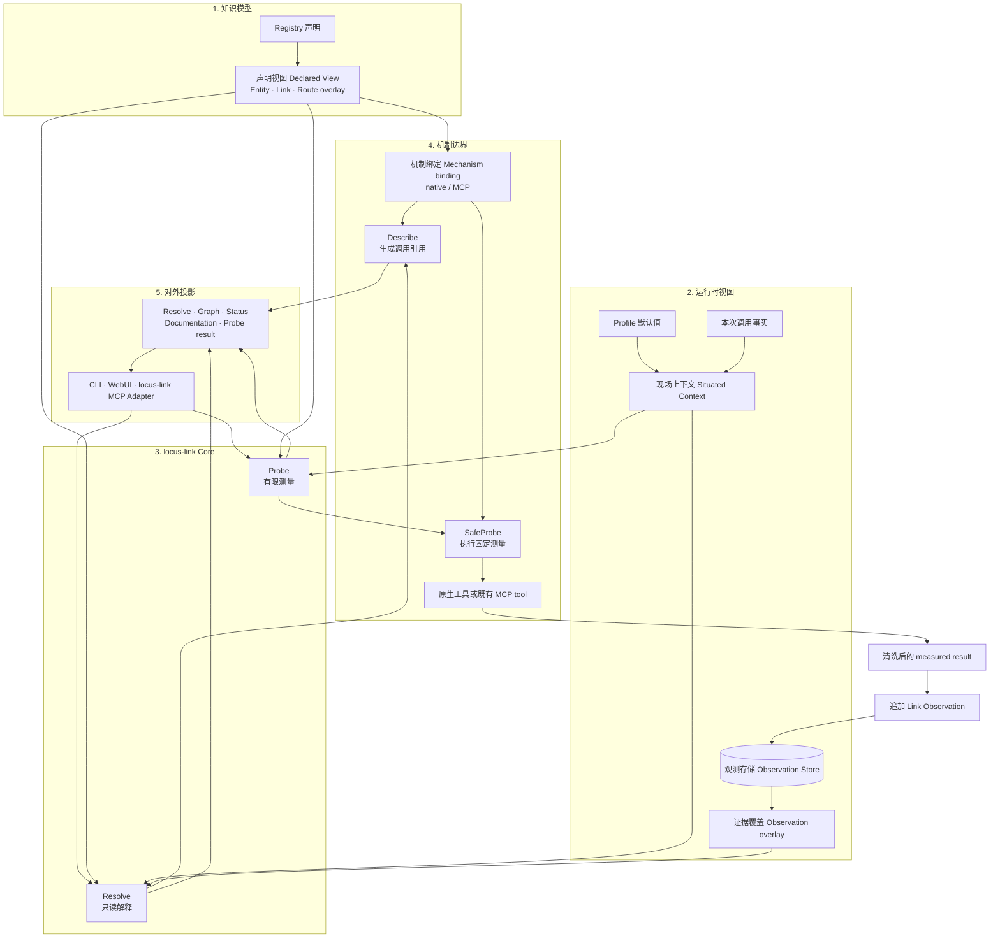
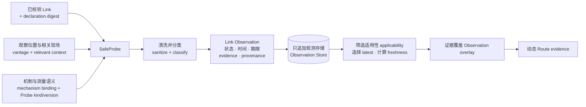

# locus-link 系统设计

## 简述

locus-link 保存具体项目与环境中已经沉淀的 operational knowledge：目标是什么、已知可以怎样到达或使用它、每一步依赖什么机制，以及这些方式在当前现场下有什么现实证据。

系统只有一套知识模型、一个 Core 和两个核心操作：

- **Resolve** 读取声明、现场与证据，解释已知路径；
- **Probe** 对指定 Link 做有限测量，追加新的现实证据。

- 产品问题、使用示例和名词定义见[基础核心概念](base-核心概念.md)
- Scope、Registry Source、Declared View 与 Situated Context 的形成见[基础 Home 与 Registry 设计](base-Home与Registry设计.md)
- 数据来源、持久化与 Secret 血缘见[基础数据设计](base-数据设计.md)
- YAML、CLI 和 Web 的可观察行为见[公共契约](contracts/README.md)
- 当前 Go、SQLite、Provider、CLI/Web 和 E2E 实现见[当前实现快照](../current-architecture.md)

## 职责

本文负责：

- 定义 Entity、Binding、Link 和 Route 进入 Core 后的组合与处理不变量；
- 定义 Declared View、Situated Context 和 Observation overlay 如何形成一次可查询视图；
- 定义 Resolve、Probe、Link Observation 与 Route evidence 的核心语义；
- 定义 native/MCP mechanism binding 与 Core projections 的边界。

本文不固定 Registry Source discovery、公共 wire schema、SQLite schema、Go interface、当前 Provider 清单或当前命令装配。

## 产品模型

Entity、Link/Graph、Project Route overlay，以及用户通过 Resolve 获取知识、通过 Probe 追加现实证据的完整形成过程，由[基础核心概念的“从实际工作形成可复用知识”](base-核心概念.md#从实际工作形成可复用知识)统一定义。

本文从产品模型已经形成的 Declared View、Situated Context 和 Link Observations 开始，说明 Core 如何组合、处理并投影这些信息。

## 总体架构

产品设计中的知识形成与使用过程，在系统内部自然分成五个部分。后续“详细设计”按同一顺序展开。



五个部分分别回答：

1. **知识模型**：工作中定义和沉淀了什么；
2. **运行时视图**：当前调用看到了哪些声明、现场与证据；
3. **Core 处理闭环**：怎样 Resolve，怎样 Probe 并记录；
4. **机制边界**：Link 如何关联 native 或 MCP mechanism；
5. **对外投影**：人和 Agent 怎样消费同一套知识。

## 详细设计

### 1. 知识模型

Entity、Link/Graph、Binding 和 Project Route overlay 的产品含义见[基础核心概念名词表](base-核心概念.md#名词表)。Core 只消费它们组成的 Declared View，并维持以下组合不变量：

- Entity 在 Graph 投影中表现为节点，Link 表现为有向关系；
- Scope 与 Binding 只提供归属和名称解释，不伪装成 operational Entity；
- Route 按顺序引用已有 Link，不复制 Link；
- 前序 Link 累计提供 capability，后序 Link 的 `requires` 必须由此前累计结果满足；
- Route target 由最后一条 Link 的 `to` 得到，Route provides 由全部步骤累计得到；
- Route 的 capability fold 与 Entity `from/to` 关系分别校验，不把 Route 限制为严格连续的拓扑路径。

### 2. 运行时视图

#### Declared View

Core 消费已经完成 identity 规范化、显式 import 组合、引用解析和静态校验的 **Declared View**。声明的存在与静态有效性只由 authoritative Registry Sources 决定，不由当前机器、Provider availability 或 Probe 结果决定。

#### Situated Context

**Situated Context** 描述一次调用现场：

```text
actor
current entity / from
vantage
local mechanism availability
Provider 明确需要的相关 runtime facts
```

Profile 可以提供默认值，但调用时事实仍独立形成 Situated Context。Context 只影响本次适用性和证据选择，不增加或覆盖 Entity、Link、Route。

#### Observation overlay

Observation Store 保存 Link Observation，不保存一张独立的运行时图。Core 根据当前声明、现场、mechanism binding 和 Probe semantics 选择适用记录，再将证据覆盖到对应 Link。

```text
Resolved View
= Declared View
+ selected Route overlay
+ Situated Context
+ applicable Observation overlay
```

例如：

```text
已选 Route
  SSH Link             PostgreSQL Link

Observation overlay
  success              unknown

动态 Route evidence
  unknown
```

不存在适用记录表示 `unknown`；记录超过有效期表示 `stale`。其他 declaration、vantage、binding、Probe semantics 或相关 Context 下的记录仍是历史事实，但不证明当前 Link。

### 3. Core 处理闭环

#### Resolve

Resolve 回答：

> 对于这个目标和能力，我们已知应怎样做，当前证据支持到什么程度？

处理顺序：

1. 将业务 Binding 或引用解析为 canonical target Entity；
2. 找到以该 Entity 和所需 capability 为结果的显式 Route；
3. 使用 Situated Context 检查 Route 的适用性；
4. 为每条 Link 解析 concrete mechanism invocation reference；
5. 为每条 Link 选择当前适用的 Observation；
6. 动态聚合 Route evidence，并附加声明、现场和文档 provenance；
7. 返回 resolved、unresolved 或 ambiguous 的结构化结果。

Resolve 只解释已知 Route 和已有证据。它不会触发 Probe，调用前后 Declaration 与 Observation 数量保持不变。

#### Probe

Probe 是对一条 Link 的有限测量，用于回答一个明确问题，例如 endpoint 是否可连接、客户端配置能否展开，或某个固定 MCP SafeProbe 是否成功。

Probe success 只证明其 `Probe kind + semantics version` 定义的检查通过，不证明登录、SQL 权限、部署或完整 Route 已经执行。

调用方可以请求 Probe 一条 Link，也可以请求 Probe 一条 Route。Route Probe 按步骤顺序调用各 Link 的 SafeProbe；只有实际形成测量结果的 Link 才追加 Observation。Route 本身不保存 Observation。

#### Link Observation



一条 Observation 必须能够说明：

- 测量的是哪条 canonical Link；
- 基于哪一版 Link declaration；
- 从哪个 vantage 测量；
- 使用哪个 mechanism binding；
- 执行哪种 Probe 及其 semantics version；
- 哪些 runtime context 影响该测量；
- 何时测量、结果是什么、何时过期；
- 哪些 sanitized evidence 可以公开。

Profile ID 可以作为 provenance，但不能代替真正影响测量语义的 context fingerprint。

Observation 以 append 方式保存。新记录不覆盖历史记录；读取时先筛选适用集合，再选择 latest 并计算 freshness。

#### Route evidence

Route evidence 每次从 ordered Links 的当前 evidence 动态形成：

- 任一适用且 fresh 的 Link failure，使 Route 为 failure；
- 全部 Link 都有适用且 fresh 的 success，使 Route 为 success；
- 有相关但过期的证据时保留 stale 信息；
- 缺少足够证据时为 unknown。

逐 Link evidence 与 provenance 始终保留在结果中，Route 状态不替代它们。

### 4. 机制边界

Link 通过 **mechanism binding** 关联具体实现。Core 对 native 与 MCP mechanism 使用相同的窄语义：

```text
Validate
  binding 是否完整且可解释

Describe
  返回 native invocation reference
  或 MCP server/tool reference

SafeProbe
  执行固定、可识别、可版本化的测量
  返回 measured result
```

Credential Reference 指向环境变量、Credential Manager、Vault、SSH Agent 或 MCP auth 等 Credential Source；运行时由具体机制取得凭据。Secret value 不成为 Declaration、Observation 或公共结果的一部分。

Provider adapter 只解释自己的 binding、生成 invocation reference 和执行 SafeProbe。Route selection、Observation applicability、Store append 与 Route evidence 由 Core 统一处理。

### 5. 对外投影

CLI、WebUI 和 locus-link MCP Adapter 复用同一 Core semantic model。它们可以展示不同投影，但不重新解释领域对象：

| Projection | 主要内容 |
|---|---|
| Resolve | target、Route overlay、ordered Links、mechanism references、evidence、documentation |
| Graph | Entity 节点、Link 关系、Route overlay、Scope/Binding 注解 |
| Status | 当前 vantage 的 Link evidence 与动态 Route evidence |
| Documentation | Declaration 关联的文档及其 provenance |
| Probe | 显式测量结果和新增的 Link Observation |

公共字段、URI、命令和 HTTP 行为由对应契约定义；Core 只维护一套 identity、Route、evidence、documentation containment 和 Probe 语义。

## 核心不变量

- Declaration、Situated Context 和 Observation 分别表达已知知识、本次现场和实际测量，三者不互相覆盖；
- Entity 是 operational object，Link 是已知 relationship，Route 是 ordered Link overlay；
- Route evidence 动态派生，只持久化 Link Observation；
- Resolve 只读，Probe 是追加 Observation 的入口；
- Observation 必须与 declaration、vantage、mechanism binding、Probe semantics 和相关 Context 对齐；
- Probe failure 不删除 Link，Probe success 不修改 Route；
- Graph、Status、Documentation、CLI、WebUI 和 MCP 都复用同一 Core semantic model；
- Secret value 与未经清洗的外部输出不进入持久化知识或公共结果。
