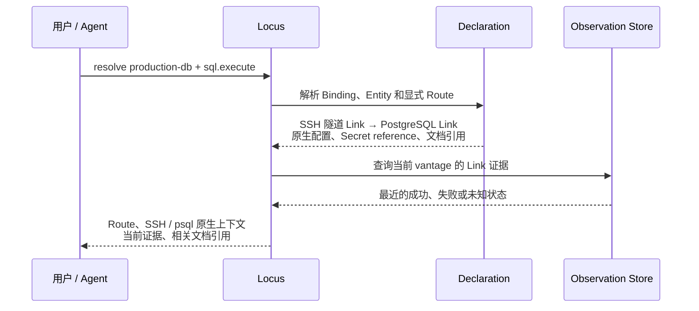

# Locus Link 产品设计

## 简述

Locus Link 描述异构环境中“如何获得某种 operational capability”的已知链路，使人和 Agent 能从语义目标理解已有操作路径、原生机制、现实证据和相关上下文。

- 当前项目快照见 [`../current-architecture.md`](../current-architecture.md)
- 用户和 Agent 依赖的 CLI 与 YAML 见[公共契约](contracts/README.md)
- 整体组件关系见 [系统设计](系统设计.md)
- 测试基准与关键样例见 [测试设计](测试设计.md)

## 职责

- 解释 Locus Link 为什么存在；
- 定义 Entity、Link、Route 的产品语义；
- 明确核心信息的生命周期和长期责任边界；

## 核心模型

Locus Link 用三个概念描述一条已知操作路径：

- **Entity**：需要访问或操作的东西，例如工作站、数据库、代码仓库、Worker 或生产服务。
- **Link**：获得一种访问或操作能力的已知方法，例如通过 SSH 登录主机。
- **Route**：为获得目标能力，按顺序组织的一组已知 Link。

下面通过一次完整的数据库访问说明这些概念如何共同工作。

### 从用户问题开始

用户在 Project 中提出：

```text
如何从当前工作站对 production-db 执行 SQL？
```

Locus 需要回答：

1. `production-db` 实际是哪一个数据库；
2. 已知应通过哪些步骤获得 `sql.execute`；
3. 这条路径是否适用于当前工作站和网络位置；
4. 最近实际探测到了什么；
5. 需要更多背景时应读取哪些文档。

### 系统如何回答



#### 1. 声明目标和已知路径

Project 中的 **Binding** 把名称 `production-db` 指向一个 canonical **Entity**。数据库 Entity 保存 host、port、database name 等目标自身的稳定事实。

显式 **Route** 包含两个 **Link**：

```text
SSH 隧道 Link
  provides: 本地数据库端点
        ↓
PostgreSQL Link
  requires: 本地数据库端点
  provides: sql.execute
```

Link 保存机制的使用方式，例如 SSH user、PostgreSQL user 和 Provider 选项。`requires/provides` 表达前一步为后一步建立的条件，因此 Route 不要求相邻 Link 满足 `previous.to == next.from`。

每个 Link 由对应 **Provider** 保留具体机制的语义：校验声明、生成原生调用上下文，并定义可以安全执行的 Probe。

这些声明由 **Scope** 确定归属，并由 Registry 保存和组织。Secret 只保存 reference，密码和令牌仍由外部凭据机制管理。

#### 2. 结合这一次的现场

Resolve 结合 **Runtime Context** 判断已知 Route 是否适用，例如当前工作站、cwd 和 vantage。它再读取每条 Link 在当前 vantage 下最近的 **Observation**，但不会因为探测成功或失败而修改声明。

需要刷新证据时，Probe 执行 Provider 定义的安全检查并追加新的 Observation。Probe 成功只说明该项检查通过，不证明认证、SQL 权限或完整路径一定可执行。

#### 3. 形成完整的路径说明

Resolve 返回 canonical Entity、显式 Route、每一步的原生调用上下文、当前证据和相关 **Documentation references**。调用方因此能够理解目标是谁、已知路径是什么、每一步如何使用，以及当前证据支持到什么程度。

#### 4. 保持声明与现实分离

- **Declaration** 保存“我们知道应当怎样访问”。
- **Observation** 保存“刚才实际测到了什么”，不会自动覆盖声明。

> Documentation reference 是声明的一部分，使 Agent 能按需读取数据库操作、迁移或排障文档。文档内容可以解释声明，但不能成为隐藏配置、覆盖结构化声明或参与 Route 的机器语义。

## 后续演进

Route 保存的是一条可复用的已知方法，还不是这一次已经建立好的连接。**实例化**就是把这条方法放进当前真实现场：确定从哪台机器开始，确认可用工具，通过 Secret reference 取得外部凭据，为隧道分配临时端口，建立连接，并把上一步产生的端点、会话或其他条件交给下一步。实际凭据只在外部机制和本次运行中使用，不写回 Locus 声明。

例如实例化 `production-db` Route 时，系统会为 SSH 隧道选择本地端口并建立隧道，再把得到的本地数据库端点交给 PostgreSQL Link，形成这一次可以实际使用的路径。临时端口、已建立的隧道、连接状态和本次 SQL 等信息共同构成 **Route Instance**。

Route Instance 建立后，路径才能进一步执行、监控，并在完成或失败时释放临时资源。整个过程仍使用 SSH、`psql` 等 Provider 对应的原生机制，而不是把它们隐藏成万能执行接口。

这条演进方向可概括为：

> `Plan / Compilation → Instantiate → Instance → Execute / Supervise / Teardown → Observation`

具体进展维护在 [`cp-locus-link.md`](../../cp-locus-link.md)，已经实现的范围见[当前项目快照](../current-architecture.md)。

## 永久边界

Locus 长期不替代：

- SSH、FRP、数据库客户端、Gitea CI/CD、Salt 或其他原生机制；
- Secret Store、Credential Manager、Vault 或 SSH Agent；
- 原生工具的权限、事务、错误和生命周期语义；
- 通用 Agent runtime、Skill、CMDB 或完整数字孪生。

> 新增抽象必须由真实路径证明，并保持显式、可解释和 provider-native。

