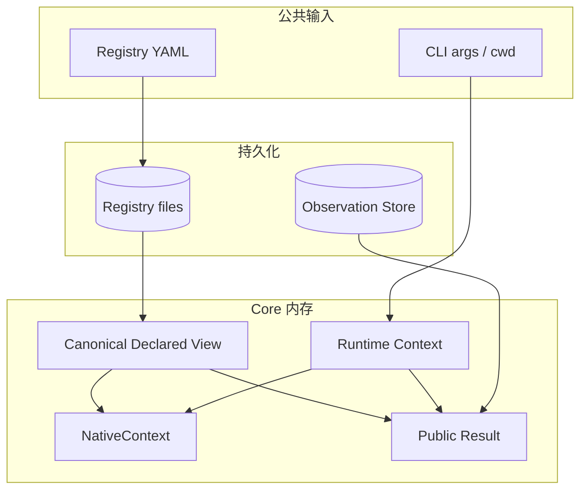
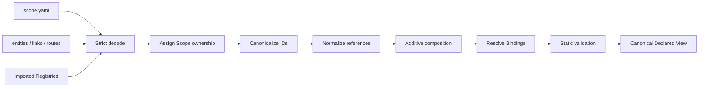
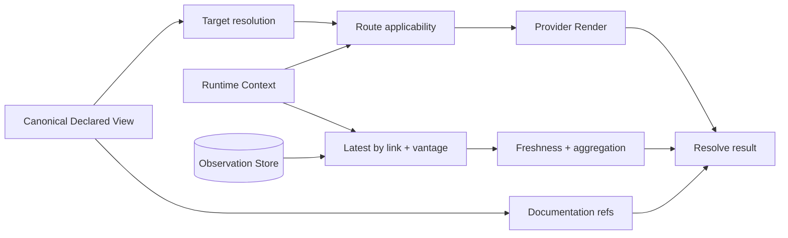
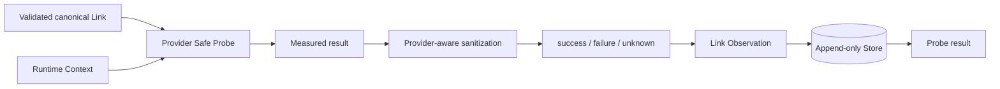
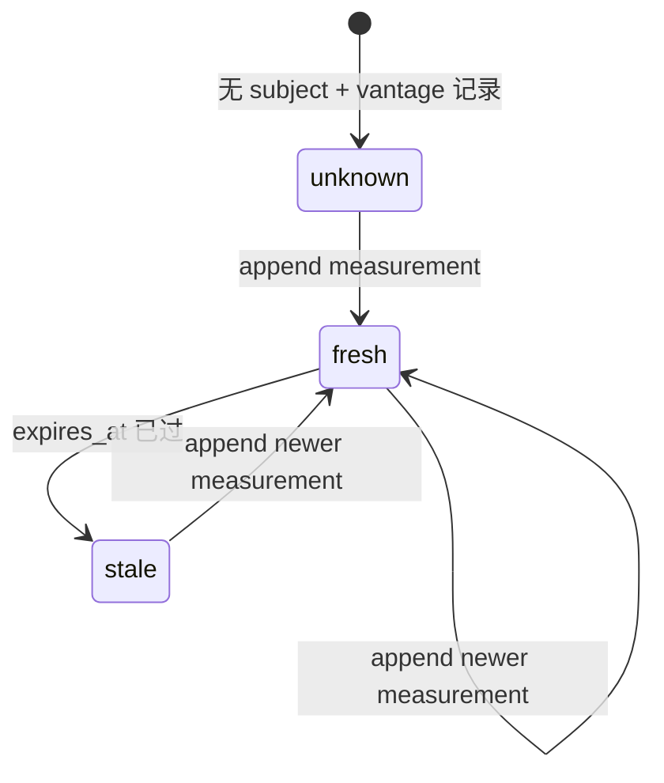
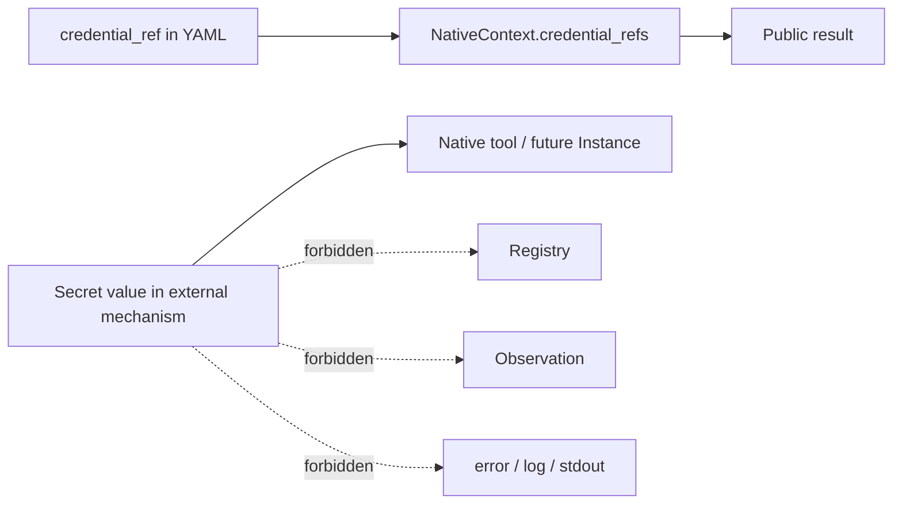

# Locus Link 数据流与存储设计

## 简述

本文说明 Locus Link 数据从哪里产生、经过哪些变换、由谁消费、保存在哪里以及何时失效。它覆盖 Registry YAML、canonical declared view、Runtime Context、Provider result、Observation、Route evidence 和公共结果，并明确 Secret value 不得进入的边界。

公共 YAML 与 CLI 字段分别见[声明契约](contracts/声明契约.md)和[CLI 契约](contracts/CLI契约.md)，处理语义见[系统设计](系统设计.md)，当前文件路径、SQLite schema 和索引见[当前实现快照](../current-architecture.md)。

## 职责

本文负责：

- 定义各类数据的来源、ownership、变换、持久化和消费者；
- 定义 Declaration、Runtime Context、Observation 和结果之间的数据血缘；
- 定义 YAML、内存视图、Observation Store 和 stdout 的存储边界；
- 定义 canonical identity、vantage、时间和 Secret reference 如何贯穿数据流；
- 约束失败时哪些数据可以写入、哪些结果不能伪造。

本文不负责：

- 重复定义公共 YAML 或 CLI JSON 的完整字段；
- 固定 SQLite 表、列、索引、migration 或操作系统路径；
- 定义 Route 匹配、Provider Probe 或 evidence 聚合算法；
- 把内部 Store schema 提升为外部查询 API。

## 数据分类

| 数据 | 权威来源 | 主要变换 | 持久化 | 消费者 |
|---|---|---|---|---|
| Registry YAML | Registry 维护者 | 严格解码、canonicalize、compose、validate | 文件 | Validate、Resolve、Probe、Inspection |
| Canonical Declared View | Registry YAML | identity 和引用归一化 | 当前仅内存 | Resolver、Provider orchestration |
| Runtime Context | 调用现场与 CLI 参数 | discovery、host-specific fallback | 不持久化 | Resolve、Probe |
| NativeContext | Provider Render | validated Link + Runtime Context | 不持久化 | Resolve result、未来 Instance |
| Safe Probe result | Provider | sanitize、classify | 不直接持久化 | Probe orchestration |
| Link Observation | Safe Probe result | 增加 canonical subject、vantage、time | Observation Store | Resolve、Status |
| Link evidence | 最新适用 Observation | freshness interpretation | 不持久化 | Resolve、Route aggregation |
| Route evidence | ordered Link evidence | 动态聚合 | 不持久化 | Resolve、Status |
| Resolve / Probe result | Core | 组合已有数据 | stdout；Core 不落库 | 用户、Agent、未来 WebUI |
| Documentation reference | Registry YAML | 相对路径归一化、去重、排序 | 随声明文件 | Show、Resolve |
| Secret value | 外部 Secret mechanism | 由外部机制或未来 Instance 解析 | 不进入 Locus stores | 原生工具或未来执行层 |

## 存储边界



只有两类当前持久事实：

1. **Registry files**：维护者审阅的 Declaration 和 documentation；
2. **Observation Store**：Safe Probe 追加的现实测量历史。

Canonical view、Runtime Context、NativeContext、Link evidence、Route evidence 和公共结果都是派生数据，不单独成为新的 truth source。

## Declaration 血缘



### 保留与派生

- local ID 来自 YAML，canonical ID 由 `scope.id + "::" + local ID` 派生；
- import alias 来自 active Project，只用于输入引用归一化，不写入 canonical ID；
- Binding role 和 canonical target 同时保留，避免无痕解引用；
- Link `from/to`、Route step 和 documentation ref 在装载后使用规范化引用；
- composition 只做集合并集，不复制或重写 imported declaration ownership。

### 失败边界

严格解码、import、identity、引用、Provider data 或 documentation validation 任一步失败时：

- 不产生可供 Resolve 使用的部分 canonical view；
- 不读取或写入 Observation；
- 不启动 Provider executable；
- CLI 返回声明错误。

## Resolve 数据流



血缘要求：

- `canonical_target` 能追溯到输入 target 和 Binding / Entity reference resolution；
- Route 和 ordered Link IDs 能追溯到原始声明及其 Scope；
- NativeContext 能追溯到具体 Link、Provider 和 Runtime Context；
- 每条 Link evidence 能追溯到 `(canonical link subject, vantage)` 的最新 Observation；
- Route evidence 能追溯到返回的全部 Link evidence；
- documentation reference 保留 canonical subject 和 normalized ref；
- Resolve 不产生新的持久化数据。

## Probe 数据流



### 写入条件

Observation 只能在已经形成实际测量结果后写入：

| 情况 | Store 行为 |
|---|---|
| Provider data 非法 | 不写入 |
| Provider 未注册 | 不写入 |
| Link 不适用于当前 Runtime Context | 不写入 |
| 测量尚未开始的系统错误 | 不伪造 Link failure |
| 实际测量 success/failure/unknown | 追加一条 Observation |
| Store append 失败 | 返回系统错误，不能报告持久化成功 |
| Route 后续步骤未尝试 | 不写入 |

Route Probe 对已经完成并成功追加的前序测量不回滚；Observation 记录的是已发生事实，不与命令整体成功组成事务。

## Observation 血缘与生命周期



一条记录的核心来源：

```text
subject     ← validated canonical Link ID
vantage     ← Runtime Context
provider    ← Link.provider / Provider Registry
status      ← Safe Probe measured result
observed_at ← Probe orchestration clock
expires_at  ← 明确的 Probe/Observation policy；可以缺省
evidence    ← Provider 明确的 probe kind 与测量范围
error       ← Provider-aware sanitized diagnostic
```

Store append-only 保存历史；Resolve / Status 查询时才解释 latest 和 freshness。Route evidence 没有独立 record、ID 或数据库行。

相同 Link 在不同 vantage 下的数据彼此独立：

```text
link.prod-ssh + office-lan → success
link.prod-ssh + home-lan   → failure
```

两条记录可以同时成立，不能互相覆盖或补齐。

## Documentation 血缘

```text
Declaration YAML
→ relative documentation ref
→ normalize against declaration source
→ validate resource existence
→ retain canonical declaration subject
→ stable deduplicate and sort
→ show / Resolve result
```

文档正文继续由文件系统管理。Locus 只保存和返回引用：

- 不把 Markdown 复制进 Observation Store；
- 不让文档覆盖 Entity / Link / Route 字段；
- 不从文档推导 capability、credential 或 Route；
- 不校验 Markdown anchor 的语义；
- 不把 documentation discovery 变成隐式执行输入。

## Secret 与敏感数据血缘



允许进入 Locus 的是 reference，不是 value：

- `credential_ref` 可以从 Declaration 流向 NativeContext 和公共结果；
- reference 不授权 Locus 自动读取 Secret；
- 外部配置 path 可以保留，但配置内容不得复制到结果；
- stdout/stderr 必须在进入 error 或 evidence 前按 Provider 语义清理；
- 截断不是 redaction；敏感片段即使短于长度上限也不得保存；
- fixtures 使用确定性假 reference，不包含真实用户凭据。

## 数据 ownership 与修改权限

| 数据 | 创建者 | 可修改者 | 修改方式 |
|---|---|---|---|
| Declaration | Registry 维护者或审阅后的 Agent patch | 对应 Scope 维护者 | 修改 YAML，重新校验 |
| Binding | active Project 维护者 | Project 维护者 | 修改 `scope.yaml` |
| Runtime Context | 调用者与环境采集 | 当前调用 | 不持久化 |
| Observation | Safe Probe orchestration | 不原地修改 | append 新记录 |
| Route evidence | Resolver | 无 | 每次查询重新计算 |
| NativeContext | Provider Render | 无 | 每次 Resolve 重新生成 |
| Secret value | 外部 Secret mechanism | 外部机制 | 不经过 Locus Store |

Probe 不修改 Declaration；Resolve 不修改任何持久数据；Store 不反向修正 Registry。Agent 调查得到的新事实必须先形成可审阅的 declaration patch，不能由推断自动写回。

## Store 可替换性边界

Observation 的语义 contract 是：

```text
append history
latest by canonical subject + vantage
latest per vantage for diagnostics
deterministic ordering
preserve time/evidence/error
```

SQLite 只是当前实现。以下内容不构成公共契约：

- database filename；
- table/column names；
- integer primary key；
- timestamp serialization；
- index definition；
- migration mechanism。

未来替换 Store 必须保持上述语义和公共 CLI 行为；不得要求 Registry 作者修改 YAML，也不得让外部调用者直接依赖内部数据库。

## 验证口径

数据流相关验证至少证明：

- 同一 YAML 经确定性装载得到稳定 canonical identity 和排序；
- 声明错误不执行 Probe、不写 Observation；
- Resolve 不改变 Registry 或 Store；
- Probe 只为实际测量的 Link 追加记录；
- vantage 严格隔离，freshness 和 Route aggregation 可追溯；
- Store 写入失败不伪装为 Probe success；
- Secret value、完整敏感配置和未清理进程输出不进入任何 Locus store 或公共结果；
- E2E 的 Registry、helper、SQLite 和输出全部保留在工作区内。

具体“前置 / 操作 / 预期”由[测试设计](测试设计.md)维护。
