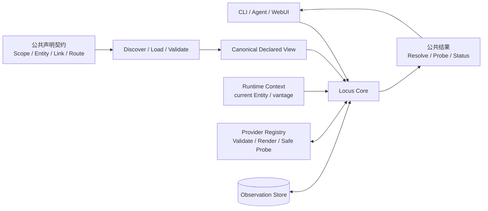
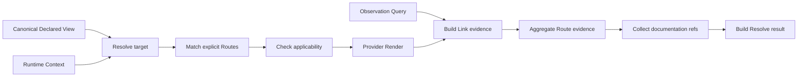
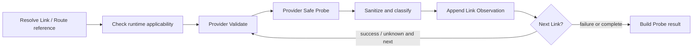

# Locus Link 系统设计

## 简述

本文定义 Locus Core 如何把公共 YAML 声明、调用现场和现实证据组合成可解释的 Resolve / Probe 结果。声明装载、canonical identity、Route 匹配、Provider adapter 和 Observation 都是同一条内部处理链，不再按名词拆成彼此跳转的平级设计。

- 用户和 Agent 依赖的稳定接口见[公共契约](contracts/README.md)
- 核心产品语义见[产品设计](产品设计.md)
- 数据来源、变换、存储和敏感边界见[数据流与存储设计](数据流与存储设计.md)
- 当前 Go、SQLite 和 Provider 实现见[当前实现快照](../current-architecture.md)
- 可执行验证见[测试设计](测试设计.md)

## 职责

本文负责：

- 定义 Locus Core 的组件关系和内部处理顺序；
- 定义声明装载、静态校验、Runtime Context、Resolve 和 Probe 的协作；
- 定义 Provider 内部端口、Safe Probe、安全和错误分类；
- 定义 Observation、vantage、freshness、Store 能力和 Route evidence 聚合；
- 保持一条从公共声明到公共结果的连续技术叙事。

本文不负责：

- 重复定义用户维护的 YAML、命令、flags、JSON 和退出码；
- 固定 Go package、函数名、SQLite schema、操作系统路径或当前 Provider 实现；
- 维护实施进度、当前代码偏差或未来任务；
- 提供自动 path discovery、万能执行器、Secret Store 或 Workflow engine。

## 公共契约与内部契约

系统以两种稳定性边界演进：

| 边界 | 内容 | 变更要求 |
|---|---|---|
| 公共契约 | CLI、JSON、Registry YAML、identity、引用和 Provider data | 保持兼容或显式升级版本 |
| 内部契约 | Loader、Resolver、Provider adapter、Store port、聚合算法和组件拆分 | 可以随实现原子调整，但必须保持公共行为 |

Provider 当前编译进同一系统，是内部 Service Provider Interface；Observation Store 当前也是内部 Port。若未来允许第三方 Provider plugin 或外部 Store consumer，应先建立新的公共契约，不能把现有 Go interface 或 SQLite schema 默认视为兼容承诺。

## 整体结构



- **Declared View** 保存经过严格解码、引用归一化和静态校验的已知事实。
- **Runtime Context** 保存本次调用才成立的 actor、vantage 和 Provider 明确需要的现场值。
- **Provider Registry** 将稳定 Provider name 映射到机制专属 adapter。
- **Observation Store** 只保存 canonical Link 在特定 vantage 下的实际测量。
- **Locus Core** 编排上述组件；入口层不复制领域模型或 evidence 规则。

Registry 是 Declaration 当前的存储和组织方式，SQLite 是 Observation Store 当前的实现。二者都不是产品本体，也不是公共数据 API。

## 核心数据关系

```text
Declaration
  Scope / Entity / Link / Route / Binding / documentation refs
  生命周期：由维护者审阅和修改

Runtime Context
  current Entity / vantage / 调用时现场
  生命周期：一次命令或请求

Observation
  canonical Link / vantage / time / measured evidence
  生命周期：append-only 历史

Resolved Result
  Declaration + Runtime Context + latest applicable Observations
  生命周期：一次无副作用计算
```

未来 Instance 表示某次具体实例化产生的 endpoint、token、session、进程和临时资源。Declaration、Observation 与 Instance 生命周期不同，任何一层都不能把临时值静默提升到另一层。

## 声明装载与静态校验

### 装载顺序


公共字段、目录和引用形式由[声明契约](contracts/声明契约.md)定义。内部装载必须满足：

- 每个输入在进入 composed view 前完成严格解码；
- canonical identity 是对象和 Observation 的唯一稳定内部身份；
- import 只增加 namespaced declarations，不修改 imported object；
- Link `from/to` 在装载后指向 canonical Entity；
- Route step 在装载后指向 canonical Link；
- Binding 保留 role 到 canonical Entity 的解释关系；
- 静态校验只有一套规则，Resolve 和 Probe 不维护第二套 identity 或 capability fold。

### 三层判断

```text
静态有效：声明本身是否自洽
    ↓
运行时适用：显式 Route 是否适合本次 Runtime Context
    ↓
现实证据：最近实际测量支持到什么程度
```

三层结论保持正交：

- 静态有效不表示 executable 存在或 endpoint 可达；
- 运行时适用不表示 Probe 已成功；
- evidence success/failure/stale/unknown 不修改声明，也不决定候选是否存在；
- 声明非法属于输入错误；没有证据只是 `unknown`。

## Runtime Context

Runtime Context 是一次 Resolve / Probe 的现场输入，不是通用 session model。它至少提供：

- active canonical declared view；
- `current_entity`：本次调用的 operational actor；
- `vantage`：Observation 成立和查询的观察位置；
- Provider rendering 或后续实例化明确需要、且不属于 Declaration 的调用时值。

`current_entity` 与 `vantage` 不可互相推导。同一 Entity 在不同网络位置可以得到不同 evidence；相同 vantage 也不表示 actor 相同。

Secret value、临时 tunnel port、SQL、token、session 和进程句柄不进入 Runtime Context 的通用字段。只有真实公共操作需要时才增加新字段。

## Resolve

### 处理流程



### Target resolution

输入 target 按公共声明语义依次尝试：

1. active Project Binding role；
2. canonical Entity ID；
3. import alias-qualified Entity ID；
4. active Scope local Entity ID。

结果必须是 canonical Entity。Binding 命中时，公共结果同时保留输入 role 和 canonical target，不做无痕解引用。

### Route 匹配

Resolve 只匹配 composed view 中已经声明并通过静态校验的 Route。候选必须：

- derived target 等于 canonical target；
- ordered capability fold 包含请求 capability；
- 每个 Link 满足当前版本明确的 Runtime Context applicability。

Applicability 必须由显式、可检查的上下文条件定义，不能依赖隐藏 Provider 特例、Observation 或图搜索。当前实现采用的窄规则和已知限制记录在[当前实现快照](../current-architecture.md)；真实案例需要前一步产生 endpoint、actor 或 session 时，应通过未来 Plan / Instance 的显式输入输出表达。

Provider executable 是否在 PATH、Probe 是否成功和 Observation 是否 fresh 都不参与 candidate selection。

### Candidate cardinality

- 0 candidate：`unresolved`；
- 1 candidate：`resolved`；
- 多 candidate：`ambiguous`，返回全部 candidates。

Candidates 只按 canonical Route ID 稳定排序。Evidence、cost、priority、声明顺序、Provider 类型、hop 数和最近成功时间不隐式参与排名。

### 结果与副作用

Resolve 组合：

- 输入 target、Binding 解释、canonical target 和请求 capability；
- target Entity 的稳定声明事实；
- canonical Route、ordered Links 和 derived capabilities；
- 每一步的 Provider、structured native context、credential references 和 Link evidence；
- Entity、Link、Route 关联的 documentation references；
- 聚合后的 Route evidence。

具体公共 JSON 由[CLI 契约](contracts/CLI契约.md)定义。Resolve 可以调用 Provider Validate / Render 和 Observation Query；它不调用 Safe Probe、不追加 Observation、不启动 executable、不建立 session，也不执行 Route action。

## Provider 内部端口

Provider Registry 以稳定 name 注册机制专属 adapter。逻辑端口包含：

```text
Provider
├─ name
├─ executable identity
├─ Validate(provider data)
├─ Render(validated Link, Runtime Context) → NativeContext
└─ SafeProbe(context, validated Link, Runtime Context) → measured result
```

这是内部 SPI，不是当前对第三方开放的 plugin API。用户需要维护的 Provider name 和 `provider_data` 由[声明契约](contracts/声明契约.md)定义。

### Validate

- 只校验 Provider-specific data 的必填字段、类型、取值和字段间约束；
- 不连接 endpoint、不运行 executable、不读取 Observation；
- 未注册 Provider 是声明错误；
- 完整 Validate 由静态校验和 Probe 共用，Render / Safe Probe 不建立语义不同的第二套校验。

### Native context rendering

Render 将已校验 Link 与 Runtime Context 转成：

```text
NativeContext
├─ provider
├─ executable
├─ args[]
└─ credential_refs[]
```

- `args` 是参数数组，不是 shell command string；
- `credential_refs` 是 opaque reference，不展开 Secret；
- Render 不运行 executable、不访问网络、不建立 session、不写 Observation；
- 平台和工具差异保留在 Provider 输出中，不污染 Link / Route 语义。

### Safe Probe

Safe Probe 是白名单内、非破坏性的窄测量：

- 使用调用方 context 控制 timeout 和 cancellation；
- 不接受任意原生命令或参数；
- 返回 provider、probe kind、实际测量范围、时间和不含原始进程输出的稳定诊断摘要；
- 不直接访问 Store，由 Probe orchestration 统一持久化；
- 不启动长期资源、不执行 Route、不修改远端业务状态；
- success 只证明对应 `evidence.kind` 的检查通过。

例如 TCP endpoint 可达、配置可解析或原生 ping 成功，都不自动证明 credential、认证、业务权限或完整 capability 可执行。

### 错误分类与进程安全

Provider 必须区分：

| 类型 | 含义 | 是否形成 failure Observation |
|---|---|---|
| 声明错误 | Provider 未注册或 data 非法 | 否；没有执行测量 |
| 启动/控制错误 | executable 无法启动、取消失效等系统故障 | 由明确测量边界决定，不能伪装为远端 failure |
| 测量 failure | Probe 已实际执行并得到否定结果 | 是 |
| 测量 unknown | 已尝试但无法形成肯定或否定结论 | 是 |
| 持久化错误 | Store append 失败 | 否；返回系统错误，不能报告 Probe success |

外部进程直接使用 executable 和参数数组，不经 shell。stdout/stderr 是不受信输入，默认不得进入 evidence、错误或日志；诊断只保留操作名、稳定失败类别，以及 Provider 明确解析并列入白名单的非敏感字段。取消必须终止本次 Probe 及其子进程。

## Observation 与 evidence

### 记录语义

一条 Observation 表示某个 canonical Link 在特定 vantage 和时间的一次实际测量，至少包含：

```text
subject / vantage / status / observed_at / optional expires_at
provider / evidence.kind / sanitized evidence / sanitized error
```

具体公共展示字段由[CLI 契约](contracts/CLI契约.md)定义，存储血缘见[数据流与存储设计](数据流与存储设计.md)。

规则：

- `subject` 必须是 canonical Link ID；
- `vantage` 与 actor Entity 分开表达；
- status 为 `success | failure | unknown`；
- evidence 说明实际测得范围，不输出含糊的全局“可用”结论；
- 记录 append-only，不修改 Declaration 或未来 Instance；
- Entity、Route 和 capability 不保存独立 Probe Observation。

### Freshness

同一 `(canonical subject, vantage)` 只使用确定排序下的最新 Observation：

- 没有记录：`unknown`；
- 有记录且没有到期或尚未到期：沿用原始 status；
- 已过 `expires_at`：`stale`，同时保留原始 status 和时间供诊断；
- 其他 vantage 的记录只用于 diagnostics，不参与当前 Route 聚合。

没有 `expires_at` 表示没有显式到期时间；Store 不得擅自套用其他 subject 或 vantage 的期限。

### Store 内部能力

Observation Store 只需提供：

- append 已脱敏的 Link Observation；
- 查询指定 canonical Link 和 vantage 的最新记录；
- 查询指定 subject 在各 vantage 的最新记录供 diagnostics；
- 保存、比较和返回时间与 evidence；
- 保留历史。

Store 损坏、不可读或写入失败是系统错误，不能伪装成 `unknown`。SQLite 表、索引、文件位置和 migration 是实现事实，不构成公共契约。

### Route evidence 聚合

对 Route 的全部 constituent Links：

- 任一 Link 有适用 fresh failure：`failure`；
- 全部 Link 都有适用 fresh success：`success`；
- 每条 Link 都有当前 vantage 记录、没有 fresh failure，且至少一条最新记录 stale：`stale`；
- 其他情况：`unknown`。

聚合只使用当前 Route 的 Link，不跨 vantage 补齐，不持久化 Route Observation。结果保留每条 Link evidence，使调用方能检查结论来源。

Evidence 与 candidate selection 正交：failure 不移除 Route，success 不提升排名，stale 不等于当前 failure，unknown 不阻止声明匹配。

## Probe orchestration



- Link Probe 只尝试目标 Link；
- Route Probe 按声明顺序尝试 constituent Links；
- 每个实际测量的 Link 追加一条 Observation；
- 前序 failure 后停止，未尝试 Link 不写记录；
- 声明非法或测量尚未开始时不追加虚假 failure；
- 已完成测量不会因后续步骤或整体命令失败而失效；
- 不创建 Route Observation。

Probe orchestration 拥有调用顺序和 Store append；Provider 不知道 Route 或 Store，Store 不解释 Provider 或 Route。

## 端到端实例

公共声明使用同一组对象：

```text
production-host
→ environment.customer-a::host.prod-01

project.liaoyu::route.prod-shell
├─ project.liaoyu::link.prod-frp
└─ project.liaoyu::link.prod-ssh
```

### 第一次 Resolve

```text
Load Project + imported Environment
→ canonicalize Binding production-host
→ validate FRP / SSH provider data
→ match route.prod-shell for capability shell
→ render frpc and ssh NativeContext
→ query both Links at vantage office-lan
→ no Observation
→ resolved Route with evidence unknown
```

### Probe

```text
probe route.prod-shell
→ validate and probe link.prod-frp
→ append FRP Link Observation
→ validate and probe link.prod-ssh
→ append SSH Link Observation
→ aggregate command result
```

若 FRP 测量 failure，SSH 未被尝试，也不写 SSH failure。若 Provider data 非法，测量不开始，不写任何“现实不可达”的 Observation。

### 第二次 Resolve

```text
same declared Route
+ same Runtime Context
+ latest office-lan Link Observations
→ same candidate
→ updated Link and Route evidence
```

Probe 只改变 evidence，不改变 Binding、canonical identity、Route 或 candidate cardinality。

## 依赖与安全不变量

- Registry loader 不读取 Observation，也不因运行结果修改 YAML。
- Resolve 读取 Provider render 和 Observation query，没有外部副作用。
- Probe 调用 Provider Safe Probe，由 orchestration 统一 append。
- Provider 不选择 Route、不访问 Store、不展开 Secret。
- Store 不解释 Registry、Provider 或 Route。
- Secret value 不进入 Declaration、Runtime Context、NativeContext、ResolveResult、Observation、错误或日志。
- documentation content 不覆盖结构化声明，也不参与匹配、渲染或聚合。
- CLI、Agent 和未来 WebUI 使用同一个 Core 和同一事实来源。

## 后续 Plan、Instance 与执行

当前 Core 不提供通用 Execute。未来 Route 需要建立 tunnel、数据库连接、session 或部署动作时：

- Plan / Compilation 显式描述 step 输入输出；
- Instance 保存本次 endpoint、token、session、进程和临时资源；
- 对应 Provider 定义窄而原生的 instantiate / execute / supervise / teardown；
- 前一步 runtime output 通过 Instance 显式传递；
- 权限、事务、取消、错误和资源释放语义不被万能接口抹平；
- execution observation 与 Safe Probe evidence 使用不同 source / operation kind。

新复杂度首先进入本文件保持端到端连续性。只有出现独立受众、独立生命周期或多份稳定设计后，才拆出新的内部专题文档。
