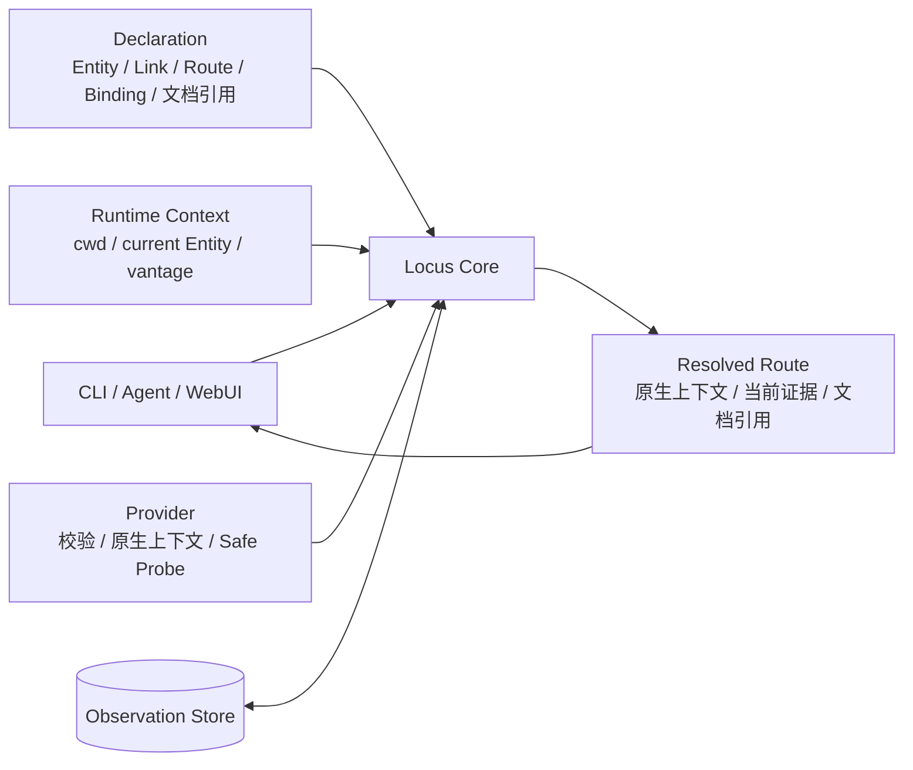
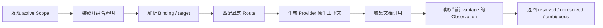
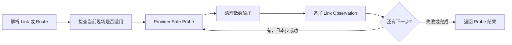

# Locus Link 系统设计

## 简述

Locus Link 以同一个 Core 处理声明、路径解析、Provider 原生上下文和 Observation。CLI、Agent 与后续 WebUI 都应使用这套 Core 和同一份事实来源。

- [产品设计](产品设计.md)：核心模型和长期边界。
- [CLI 设计](CLI设计.md)：命令、参数和用户可见行为。
- [测试设计](测试设计.md)：E2E 基准和关键样例。
- [声明与解析设计](声明与解析设计.md)：声明组织、canonical identity、Runtime Context、Route applicability 和结果基数。
- [Provider 设计](Provider设计.md)：原生上下文和 Safe Probe。
- [Observation 设计](Observation设计.md)：vantage、freshness、聚合和 Store。
- 当前实现形态见 [`../current-architecture.md`](../current-architecture.md)

## 职责

- 说明系统的整体结构和组件关系；
- 说明 Resolve 与 Probe 的主要数据流；
- 约束组件之间的依赖和副作用；
- 指向各专题设计，不重复其内部规则。

## 整体结构

- **CLI / Agent / WebUI** 提供不同使用入口，不各自维护一套领域模型。
- **Locus Core** 负责装载声明、解析目标、匹配显式 Route、调用 Provider 和组合证据。
- **Declaration** 保存已知的 Entity、Link、Route、Binding、Secret reference 和文档引用。
- **Runtime Context** 提供这次调用的 cwd、current Entity、vantage 等现场信息。
- **Provider** 保留 SSH、FRP、PostgreSQL、Salt 等机制的原生语义。
- **Observation Store** 保存按 canonical Link 和 vantage 记录的实际证据。

Registry 是 Declaration 当前的保存与组织方式；SQLite 是 Observation Store 当前的实现。二者都不定义产品本体。

## Resolve

Resolve 返回：

- 输入名称及其 canonical Entity；
- 匹配的显式 Route 和有序 Link；
- 每一步的 Provider 原生上下文和 Secret reference；
- Entity、Link、Route 关联的文档引用；
- 当前 Link evidence 和聚合后的 Route evidence。

Resolve 只组合声明、调用现场和已有证据。它不调用 Probe，也不写 Observation。

## Probe

Probe 只测量 Provider 明确定义的安全检查：

- Route 按声明顺序探测；
- 前一步失败后停止；
- 只为实际尝试的 Link 追加 Observation；
- Route 状态由 Link Observation 动态聚合，不单独持久化；
- Probe success 只说明该检查通过，不代表完整 capability 一定可执行。

## 依赖边界

- Registry 不读取 Observation，也不因运行结果修改 Declaration。
- Resolve 使用 Provider Render 和 Observation Query，但没有写副作用。
- Probe 使用 Provider Probe，并由 Core 统一追加 Observation。
- Provider 不选择 Route，也不直接访问 Observation Store。
- Observation Store 不解释 Route、Provider 或 Registry 语义。
- Secret value 不进入 Declaration、Resolved Result、Observation 或错误。
- 外部 executable 使用参数数组调用，不经过 shell 再解释。

这些边界保证 canonical identity、Route、Provider 和 evidence 各有唯一规则来源。
